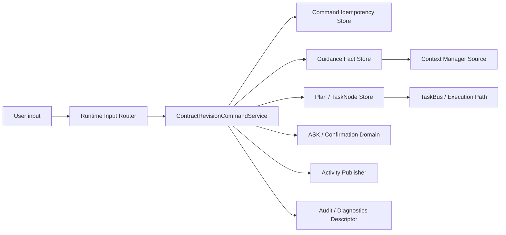
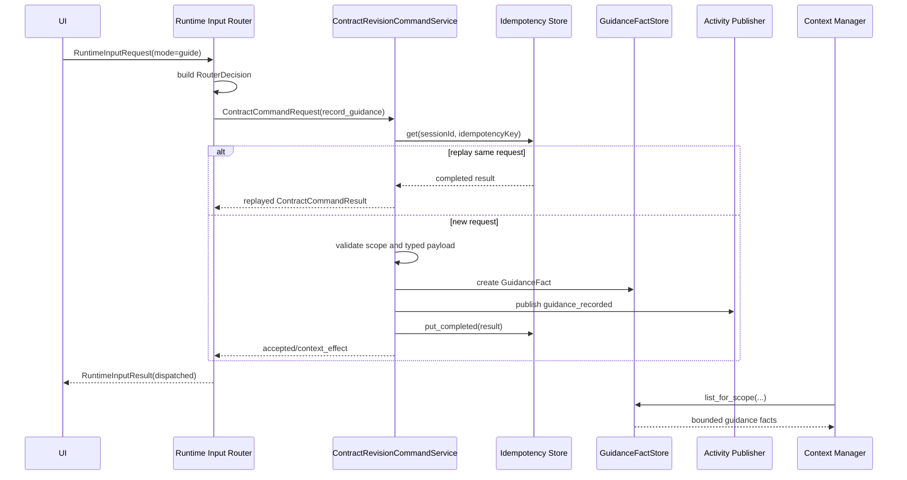
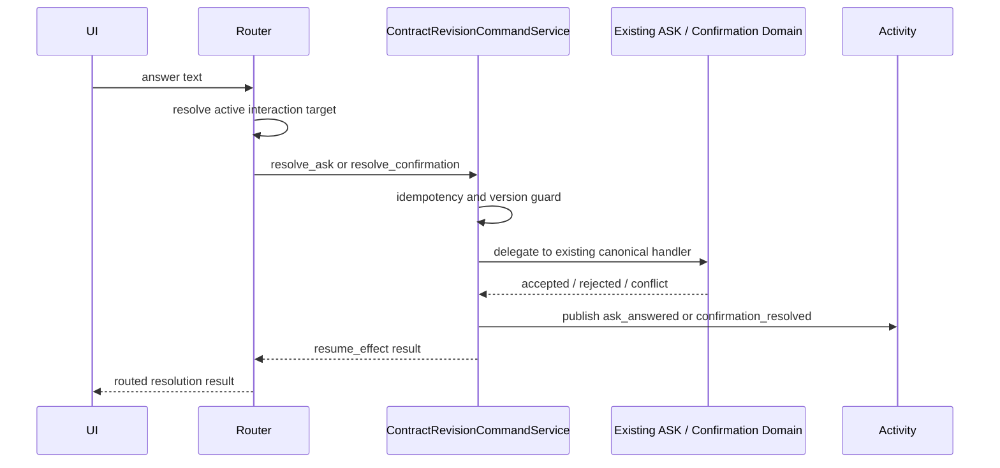
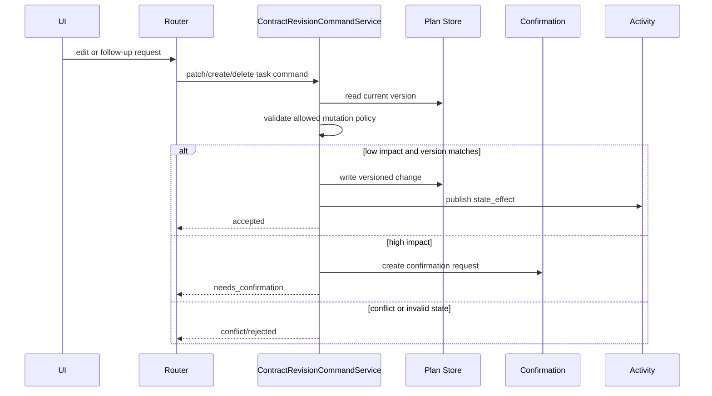

# Contract Revision Command Skills 中文详细技术方案

> Status: CRS-A、CRS-B、CRS-C 已实现；CRS-D 已实现 `patch_task_node`；
> TaskNode create/delete 与 execution handoff 仍为 planned
>
> Last Updated: 2026-06-18
>
> Feature Plan:
> [Contract Revision Command Skills](contract-revision-command-skills.md)
>
> Product Inputs:
> [Product 1.1 Open Work](../../product/plato-1-1-open-work.md),
> [Plato Contract Loop Product Model](../../product/plato-contract-loop-model.md),
> [Plato Runtime Input Model](../../product/plato-runtime-input-model.md),
> [Plato Session Content Model](../../product/plato-session-content-model.md)
>
> Engineering Inputs:
> [Runtime Input Router Contract](runtime-input-router-contract.md),
> [Runtime Input Router Technical Design](runtime-input-router-contract-technical-design.md),
> [Runtime Input And Contract Revision Program](runtime-input-and-contract-revision-program.md),
> [Session Conversation / Activity Timeline](session-conversation-activity-timeline.md),
> [Plan / TaskNode Contract Migration](plan-tasknode-contract-migration.md)

---

## 1. 目标

本方案把 Contract Revision Command Skills 落到可实现的后端技术边界。

Product 1.1 的 P0 已经收敛为：

```text
Runtime Input Router
  + Contract Revision Command Skills
  + durable Activity / Audit evidence
```

Runtime Input Router 负责判断用户输入的意图；Contract Revision Command
Skills 负责所有产品状态副作用。Router 不直接修改 Plan、TaskNode、ASK、
confirmation、TaskBus 或 workspace 文件。

本方案第一阶段目标：

1. 定义统一的 command request envelope 和 command result shape。
2. 定义命令级 idempotency、version guard、conflict 和 rejected 语义。
3. 实现 `record_guidance` 的技术边界，使用户指导成为 typed context fact。
4. 为后续 Plan/TaskNode patch/create/delete、ASK/confirmation routed
   resolution、execution request handoff 留出一致的扩展口。
5. 确保每个 accepted command 都有 durable Activity、Audit ref 和 diagnostics
   descriptor。

## 2. 非目标

- 不实现公开 skill marketplace。
- 不实现用户自定义 skill authoring UI。
- 不实现 MCP tool execution。
- 不实现 browser automation。
- 不实现通用 Router Agent。
- 不允许 prompt-only state mutation。
- 不允许 Router 直接写 workspace 文件或运行 shell。
- 不替换现有 ASK / confirmation / TaskBus 领域机制。
- 不把 Activity 当作 canonical store；Activity 只解释 canonical facts。

## 3. 当前接入点

已有代码提供了可复用边界：

| 现有模块 | 当前职责 | 本方案用法 |
|---|---|---|
| `taskweavn.server.ui_contract.runtime_input` | Runtime Input Router request/result/decision 合同。 | command skills 接收 `routerDecisionId`，并返回 Router 可投影的 result refs。 |
| `taskweavn.server.runtime_input_router` | deterministic Router foundation。 | 增加 command skill service 依赖，先接 `record_guidance`。 |
| `taskweavn.server.ui_contract.commands` | UI command payloads。 | 不直接承载所有 Contract Revision domain model；必要时只加 UI adapter payload。 |
| `taskweavn.server.ui_contract.command_gateway` | UI command gateway 编排。 | 继续承载显式 UI 命令；Router-dispatched contract commands 应经新 service，再按需调用现有 gateway/domain service。 |
| `taskweavn.server.ui_command_idempotency` | HTTP UI command response 级 idempotency。 | 可复用思想，但 command skills 需要领域命令级 idempotency，避免只缓存 HTTP response。 |
| `taskweavn.server.runtime_input_activity` | Router answer Activity 持久化 seam。 | 扩展为 Router command outcome Activity publisher，或新增专用 publisher。 |
| `taskweavn.server.ui_contract.session_activity_projection` | typed Activity projection。 | 增加 `guidance_recorded`、`ask_answered`、`confirmation_resolved` 等 Router command facts 的投影来源。 |
| `taskweavn.task.plan_models` | durable Plan / PlanTaskNode。 | Plan/TaskNode command 的 canonical model。 |
| `taskweavn.task.plan_stores` / `sqlite_plan_store` | durable Plan store。 | 后续 patch/create/delete 命令的存储边界。 |
| `taskweavn.interaction` / ASK stores | ASK domain。 | `resolve_ask` 只委托现有 ASK command lifecycle。 |
| `taskweavn.context` | Context Manager。 | `record_guidance` 写入 typed guidance 后，由 ContextSource 按 scope 和 budget 进入上下文。 |

设计原则：

```text
不要新增绕过现有 domain store / Context Manager / Activity projection 的
隐藏状态通道。
```

## 4. 建议模块边界

建议新增后端包：

```text
src/taskweavn/contract_revision/
  __init__.py
  models.py
  service.py
  idempotency_store.py
  sqlite_idempotency_store.py
  guidance_store.py
  sqlite_guidance_store.py
  guidance_commands.py
  tasknode_commands.py
  interaction_commands.py
  execution_handoff.py
  activity.py
  diagnostics.py
```

第一阶段只需要实现：

```text
models.py
service.py
idempotency_store.py
sqlite_idempotency_store.py
guidance_store.py
sqlite_guidance_store.py
guidance_commands.py
activity.py
diagnostics.py
```

不建议把所有逻辑塞进 `server/runtime_input_router.py` 或
`server/ui_contract/command_gateway.py`。Router 是 dispatcher，UI command
gateway 是 UI command facade；Contract Revision Command Skills 应该是一个
产品领域能力层，供 Router 和显式 UI 命令复用。

### 4.1 架构总览



这张图表达三个约束：

1. Router 只做意图判断和分发，不直接修改产品状态。
2. Command Service 是唯一的 contract-revision side-effect boundary。
3. Activity、Audit、diagnostics 解释 canonical facts，但不替代 canonical store。

### 4.2 关键时序

`record_guidance` 第一阶段时序：



ASK / confirmation 后续阶段时序：



Plan / TaskNode mutation 后续阶段时序：



## 5. 核心数据模型

模型风格应沿用 `UiContractModel` / Pydantic 严格合同风格：

- `extra="forbid"`；
- 字段显式；
- Literal status；
- JSON-safe；
- 不存 raw provider payload、absolute path、tool args、SQLite row、secret。

### 5.1 Literal Types

建议 literal：

```python
ContractCommandKind = Literal[
    "record_guidance",
    "patch_task_node",
    "create_task_node",
    "delete_task_node",
    "create_execution_task",
    "resolve_ask",
    "resolve_confirmation",
]

ContractCommandStatus = Literal[
    "accepted",
    "rejected",
    "needs_confirmation",
    "conflict",
    "noop",
    "unsupported",
]

ContractCommandScopeKind = Literal[
    "session",
    "plan",
    "task",
    "ask",
    "confirmation",
]

ContractCommandSource = Literal[
    "runtime_input",
    "explicit_ui",
    "system_recovery",
    "test_fixture",
]
```

`sideEffect` 直接复用 Activity 合同中的语义：

```python
SessionActivitySideEffect = Literal[
    "no_effect",
    "context_effect",
    "state_effect",
    "authorization_effect",
    "resume_effect",
    "execution_request",
    "evidence_effect",
]
```

### 5.2 Command Request Envelope

所有 command skills 接收同一个 envelope：

```python
class ContractCommandRequest(ContractRevisionModel):
    command_id: str
    idempotency_key: str
    command_kind: ContractCommandKind
    workspace_id: str
    session_id: str
    scope_kind: ContractCommandScopeKind
    plan_id: str | None = None
    task_node_id: str | None = None
    ask_id: str | None = None
    confirmation_id: str | None = None
    source: ContractCommandSource
    router_decision_id: str | None = None
    input_message_ref: ObjectRef | None = None
    expected_version: int | None = None
    payload: dict[str, object]
```

关键规则：

1. `command_id` 是本次尝试 id。
2. `idempotency_key` 是副作用 replay guard。Router dispatch 必须提供。
3. `router_decision_id` 只在 Runtime Input Router 触发时需要。
4. `expected_version` 用于 Plan、TaskNode、ASK、confirmation 版本检查。
5. `payload` 进入具体 command handler 后必须再解析成 typed payload。
6. envelope 不携带 raw diagnostic payload。

### 5.3 Command Result Shape

```python
class ContractCommandResult(ContractRevisionModel):
    command_id: str
    idempotency_key: str
    command_kind: ContractCommandKind
    status: ContractCommandStatus
    side_effect: SessionActivitySideEffect
    scope_kind: ContractCommandScopeKind
    session_id: str
    plan_id: str | None = None
    task_node_id: str | None = None
    refs: tuple[SessionActivityRefView, ...] = ()
    activity: ContractCommandActivityDescriptor | None = None
    audit: ContractCommandAuditDescriptor | None = None
    diagnostics: ContractCommandDiagnosticDescriptor | None = None
    new_version: int | None = None
    reason_code: str | None = None
    message_key: str | None = None
```

状态含义：

| Status | 含义 | 是否允许副作用 |
|---|---|---:|
| `accepted` | command 已写入 canonical facts。 | yes |
| `noop` | command 与已有状态一致，没有新写入。 | no new effect |
| `needs_confirmation` | 需要用户确认后才能写入。 | only authorization request |
| `conflict` | version/idempotency/state 冲突。 | no |
| `rejected` | 目标不存在、状态非法、payload 不合法。 | no |
| `unsupported` | route 被识别但能力未实现。 | no |

`activity`、`audit`、`diagnostics` 是 descriptor，不是 canonical state。
它们用于投影、链接和导出。

## 6. Idempotency 设计

HTTP idempotency 只能保证 HTTP response replay，不足以保证内部 command
side effect replay。Contract Revision Command Skills 需要领域级 store。

建议接口：

```python
class ContractCommandIdempotencyStore(Protocol):
    def get(
        self,
        session_id: str,
        idempotency_key: str,
    ) -> ContractCommandRecord | None: ...

    def put_started(
        self,
        request: ContractCommandRequest,
        request_hash: str,
    ) -> ContractCommandRecord: ...

    def put_completed(
        self,
        request: ContractCommandRequest,
        request_hash: str,
        result: ContractCommandResult,
    ) -> ContractCommandRecord: ...
```

SQLite 表建议：

```sql
CREATE TABLE IF NOT EXISTS contract_revision_command_records (
    session_id TEXT NOT NULL,
    idempotency_key TEXT NOT NULL,
    command_id TEXT NOT NULL,
    command_kind TEXT NOT NULL,
    request_hash TEXT NOT NULL,
    status TEXT NOT NULL,
    result_json TEXT,
    created_at TEXT NOT NULL,
    completed_at TEXT,
    PRIMARY KEY (session_id, idempotency_key)
);
```

规则：

1. 相同 `(session_id, idempotency_key)` + 相同 `request_hash` 返回原 result。
2. 相同 key + 不同 hash 返回 `conflict`。
3. started 但未 completed 的记录应返回 retryable conflict 或由实现定义
   recovery policy，不能重新执行副作用。
4. `noop` 和 `rejected` 也应可 replay，避免用户重复提交造成不一致提示。

## 7. Guidance Fact 设计

### 7.1 为什么第一步做 `record_guidance`

Product 1.1 的一个核心问题是：用户并不总是在“下命令”，他们经常是在补充
偏好、限制、纠正和上下文。当前这类输入容易被当成普通 chat/message，导致：

- 后续 Context Manager 不知道它的作用域；
- Activity 无法解释“这句话改变了什么”；
- Audit/diagnostics 无法说明为什么 Agent 后续行为改变；
- Router 的 guidance route 只能返回 unsupported。

`record_guidance` 是最小的 command-backed context effect。

### 7.2 Guidance 模型

```python
GuidanceKind = Literal[
    "preference",
    "constraint",
    "instruction",
    "correction",
    "context_note",
]

class GuidanceFact(ContractRevisionModel):
    guidance_id: str
    workspace_id: str
    session_id: str
    scope_kind: Literal["session", "plan", "task"]
    plan_id: str | None = None
    task_node_id: str | None = None
    guidance_kind: GuidanceKind
    guidance_text: str
    applies_to_future_tasks: bool = False
    source_command_id: str
    source_router_decision_id: str | None = None
    source_message_ref: ObjectRef | None = None
    version: int = 1
    created_at: datetime
    archived_at: datetime | None = None
```

### 7.3 Guidance Store

建议接口：

```python
class GuidanceFactStore(Protocol):
    def create(self, fact: GuidanceFact) -> GuidanceFact: ...

    def get(self, session_id: str, guidance_id: str) -> GuidanceFact | None: ...

    def list_for_scope(
        self,
        *,
        session_id: str,
        plan_id: str | None = None,
        task_node_id: str | None = None,
        include_archived: bool = False,
        limit: int = 50,
    ) -> tuple[GuidanceFact, ...]: ...
```

SQLite 表建议：

```sql
CREATE TABLE IF NOT EXISTS guidance_facts (
    guidance_id TEXT PRIMARY KEY,
    workspace_id TEXT NOT NULL,
    session_id TEXT NOT NULL,
    scope_kind TEXT NOT NULL,
    plan_id TEXT,
    task_node_id TEXT,
    guidance_kind TEXT NOT NULL,
    guidance_text TEXT NOT NULL,
    applies_to_future_tasks INTEGER NOT NULL DEFAULT 0,
    source_command_id TEXT NOT NULL,
    source_router_decision_id TEXT,
    source_message_ref_json TEXT,
    version INTEGER NOT NULL,
    created_at TEXT NOT NULL,
    archived_at TEXT
);

CREATE INDEX IF NOT EXISTS idx_guidance_facts_session_scope_created
    ON guidance_facts(session_id, scope_kind, plan_id, task_node_id, created_at);
```

### 7.4 `record_guidance` 流程

```text
Router(mode=guide or guidance intent)
  -> ContractRevisionCommandService.execute(record_guidance)
  -> idempotency check
  -> validate scope
  -> GuidanceFactStore.create
  -> command result accepted/context_effect
  -> Activity publisher writes guidance_recorded
  -> Router returns dispatched result
```

Validation：

- `session_id` 必须存在于当前 workspace runtime。
- `scope_kind=session` 不需要 Plan/Task。
- `scope_kind=plan` 必须有 `plan_id`，且 Plan 属于 session。
- `scope_kind=task` 必须有 `task_node_id`，且 TaskNode 属于 Plan/session。
- `guidance_text.strip()` 非空，长度受限。
- `guidance_kind` 必须是稳定 literal。
- idempotent replay 不创建重复 fact。

Result：

- `status=accepted`
- `side_effect=context_effect`
- `activity.kind=guidance_recorded`
- `source_kind=router` if routed
- `refs` 至少包含 session/plan/task scope ref 和 diagnostic/audit ref。

## 8. Context Manager 接入

第一阶段不应该把 guidance 直接拼到 prompt。应新增一个 Context Source：

```text
GuidanceFactStore
  -> ContractGuidanceContextSource
  -> SessionContextManager
  -> TaskExecutionContextV0
  -> renderer
```

Context inclusion policy：

| Scope | 进入哪些上下文 | 默认 |
|---|---|---|
| session guidance | 当前 session 的 authoring/execution context | yes, bounded |
| plan guidance | 当前 active Plan authoring/execution context | yes |
| task guidance | 目标 Task execution context | yes |
| applies_to_future_tasks | follow-up authoring context | yes, bounded |
| archived guidance | 不进入 normal context | no |

Trace 要求：

- ContextTrace 应记录 guidance candidate count、included count、truncated count。
- 每条 included guidance 应有 stable ref/hash，不暴露 hidden store row。
- diagnostics 只导出 safe summary 和 redacted/truncated text。

## 9. Runtime Input Router 集成

`DefaultRuntimeInputRouter` 当前在 `mode == "guide"` 时返回 unsupported。
CRS-B 完成后改为：

```text
if request.mode == "guide" or guidance intent:
    if contract_revision_service is None:
        return unsupported(no mutation)
    return _record_guidance(request)
```

Router 到 command service 的映射：

| Router field | Command request field |
|---|---|
| `request.command_id` | `command_id` |
| `request.command_id` or derived key | `idempotency_key` |
| `request.workspace_id` | `workspace_id` |
| `request.session_id` | `session_id` |
| `decision.id` | `router_decision_id` |
| `request.selection.scope_kind` | `scope_kind` |
| `request.selection.plan_id` | `plan_id` |
| `request.selection.task_node_id` | `task_node_id` |
| `request.content` | `payload.guidance_text` |
| `request.mode` / classifier output | `payload.guidance_kind` |

Router result：

- `decision.dispatchTarget="record_guidance"`
- `decision.sideEffect="context_effect"`
- `outcome.status="dispatched"`
- `commandResponse` 可为空或承载 adapter response，但必须有 `activity`
  或可 durable replay 的 activity ref。

为了减少前端破坏，第一步可以让 Router response 返回
`SessionActivityItemView`，同时 Activity publisher 写入 durable MessageStream
或后续专门 store。

## 10. Activity 设计

现有 `SessionActivityItemKind` 已包含：

- `guidance_recorded`
- `ask_answered`
- `confirmation_resolved`
- `router_interpretation`

第一阶段建议：

1. 扩展 `RuntimeInputActivityPublisher` 或新增
   `ContractRevisionActivityPublisher`。
2. 先用 MessageStream 存 Activity-compatible facts，和 read-only inquiry
   的实现路线保持一致。
3. `DefaultSessionActivityProjectionService` 从 message context 中识别
   `runtime_input_activity_kind="guidance_recorded"` 并投影。

建议 message context：

```json
{
  "runtime_input_activity_kind": "guidance_recorded",
  "runtime_input_side_effect": "context_effect",
  "runtime_input_decision_id": "rir-...",
  "contract_command_id": "cmd-...",
  "contract_command_kind": "record_guidance",
  "guidance_id": "guidance-...",
  "activity_related_refs": []
}
```

Activity 展示：

| Field | 值 |
|---|---|
| `kind` | `guidance_recorded` |
| `title` | UI text key 映射，例如 `activity.guidanceRecorded.title` |
| `body` | guidance 摘要，按长度截断 |
| `scopeKind` | session / plan / task |
| `sideEffect` | `context_effect` |
| `sourceKind` | `router` |
| `sourceId` | `routerDecisionId` 或 `commandId` |

## 11. Audit / Diagnostics 设计

每个 accepted command 产生安全 descriptor。

### 11.1 Audit Descriptor

```python
class ContractCommandAuditDescriptor(ContractRevisionModel):
    command_id: str
    command_kind: ContractCommandKind
    status: ContractCommandStatus
    side_effect: SessionActivitySideEffect
    session_id: str
    plan_id: str | None = None
    task_node_id: str | None = None
    target_ref: ObjectRef | None = None
    summary: str
    safe_before_after: tuple[ContractFieldChangeSummary, ...] = ()
```

`record_guidance` 的 audit summary 不需要完整泄露 guidance 文本。可以记录：

- guidance kind；
- scope；
- length；
- truncated preview；
- source router decision；
- command id。

### 11.2 Diagnostic Descriptor

Diagnostics 必须避免：

- secrets；
- provider payload；
- raw prompt；
- raw EventStream rows；
- SQLite rows；
- absolute workspace paths；
- unbounded guidance text。

建议导出字段：

```json
{
  "kind": "contract_revision_command",
  "commandKind": "record_guidance",
  "status": "accepted",
  "sideEffect": "context_effect",
  "scopeKind": "task",
  "hasGuidanceText": true,
  "guidancePreview": "short redacted preview",
  "truncated": true,
  "routerDecisionId": "rir-..."
}
```

## 12. ASK / Confirmation Routed Resolution

CRS-C 不应重写 ASK/confirmation domain。

设计：

```text
Router active interaction route
  -> ContractRevisionCommandService
  -> resolve_ask / resolve_confirmation adapter
  -> existing UiCommandGateway / domain command
  -> Activity ask_answered / confirmation_resolved
```

规则：

- explicit UI answer 和 routed input answer 必须共享同一 canonical handler。
- repeated answer 必须 idempotent，不能 double resume。
- answer shape 不匹配时返回 `rejected` 或 clarification。
- active interaction state 由 backend authoritative projection 决定，不能只信 clientState。

## 13. Plan / TaskNode Mutation Commands

CRS-D 需要等 CRS-A/CRS-B 稳定后再做。

### 13.1 `patch_task_node`

允许第一批字段：

- `title`
- `intent`
- `summary`
- `instructions`
- `constraints`
- `acceptance_criteria`
- editable order metadata

Validation：

- Plan/TaskNode 属于当前 session。
- `expected_version` 匹配。
- Plan 状态允许编辑。
- running/done/cancelled TaskNode 默认不允许直接改，除非进入确认或 follow-up path。
- high-impact changes 返回 `needs_confirmation`。

### 13.2 `create_task_node`

用途：

- 用户提出 follow-up work；
- Router 将 workspace-changing request 转成 executable contract；
- recovery 建议创建补救任务。

必须保证：

- insertion position deterministic；
- idempotent replay 不产生重复 TaskNode；
- Activity/Audit 能解释为什么新增。

### 13.3 `delete_task_node`

第一版建议 archive/tombstone，不做物理删除。

规则：

- 未执行 TaskNode 可 archive。
- 已有 execution evidence 的 TaskNode 只能 hide/archive，不能删除证据。
- destructive change 需要 confirmation。

## 14. Execution Request Handoff

`create_execution_task` 的职责是把用户的 workspace-changing input 变成可执行
contract work，而不是直接执行。

禁止：

- 直接调用 shell。
- 直接调用 file tools。
- 直接调用 web search/fetch。
- 绕过 Plan/TaskNode 和 TaskBus。

允许：

```text
workspace-changing input
  -> create executable TaskNode
  -> optional confirmation
  -> publish/execute accepted path
  -> TaskBus owns workspace mutation
```

Result side effect：

- 如果只创建 TaskNode：`state_effect`
- 如果已经进入 accepted execution path：`execution_request`

## 15. 错误和冲突语义

| 场景 | Result status | reasonCode | 是否副作用 |
|---|---|---|---:|
| 目标 session/Plan/Task 不存在 | `rejected` | `target_not_found` | no |
| version 不匹配 | `conflict` | `version_conflict` | no |
| idempotency key 冲突 | `conflict` | `idempotency_conflict` | no |
| payload 不合法 | `rejected` | `invalid_payload` | no |
| Plan 状态不允许 | `rejected` | `invalid_plan_state` | no |
| 需要用户确认 | `needs_confirmation` | `confirmation_required` | authorization only |
| 能力尚未实现 | `unsupported` | `unsupported_command` | no |
| replay 已完成命令 | original status | original reason | no new effect |

UI 文案应使用稳定 `messageKey`，而不是后端硬编码长句。

## 16. 观测性、迁移和回滚

### 16.1 观测性

第一阶段需要能回答三个问题：

1. 用户输入被 Router 判定为什么意图？
2. command 是否真正产生了产品状态副作用？
3. 后续 Agent 行为为什么受到了这条 guidance / ASK / confirmation 影响？

建议新增或复用以下可观测点：

| 位置 | 记录内容 | 注意事项 |
|---|---|---|
| Router decision | intent、target、confidence、sideEffect、reasonCodes | 不记录 raw prompt chain。 |
| Command Service | commandKind、status、reasonCode、idempotency replay/conflict | 不记录 secrets、workspace absolute path。 |
| Guidance Store | guidanceId、scope、kind、createdAt、archivedAt | diagnostics 只导出 preview/hash。 |
| Activity | user-visible title/body、refs、sourceKind/sourceId | Activity 不是 canonical state。 |
| Context Trace | candidate count、included count、truncated count | guidance text 需要按预算截断。 |

### 16.2 数据迁移

CRS-A/CRS-B 新增两类持久化数据：

1. `contract_revision_command_records`：命令级 idempotency 记录。
2. `guidance_facts`：用户指导事实。

迁移策略：

- 使用 workspace-local SQLite lazy migration，随 workspace runtime 初始化建表。
- 不修改现有 Plan、TaskNode、ASK、confirmation 表。
- 不回填历史 chat/message 为 guidance fact，避免误判历史语义。
- 旧 session 没有 guidance facts 时，ContextSource 返回空集合，不影响现有执行。
- schema 变更必须 additive；如果后续需要删除字段，先做 reader 兼容再做清理。

### 16.3 兼容性

兼容要求：

- 没有 `ContractRevisionCommandService` 注入时，Router 必须返回结构化 unsupported，
  且不产生任何副作用。
- 旧 workspace 打开后应自动拥有新表，不需要用户迁移配置。
- 旧 Activity projection 仍能展示原有 message/task/result 活动。
- explicit UI command 路径继续可用，不能被 routed command 替代破坏。
- packaged Electron 和 `npm run electron:dev` 使用同一后端语义。

### 16.4 回滚方案

如果 CRS-A/CRS-B 发布后出现问题：

1. 通过 feature flag 或依赖注入关闭 `contract_revision_service`。
2. Router `mode=guide` 回到 unsupported/no mutation 路径。
3. 已写入的 `guidance_facts` 保留，但 ContextSource 可临时不纳入上下文。
4. Activity 中已发布的 `guidance_recorded` 保留为历史事实。
5. 不删除 SQLite 表，避免破坏用户审计链。

回滚后的用户影响：

- 新的 guidance 不再被记录为 typed context。
- 已创建 Plan/TaskNode/ASK/confirmation canonical state 不被反向修改。
- 用户可继续通过原 explicit UI 路径完成 ASK / confirmation / plan 操作。

## 17. 测试方案

### 17.1 Unit Tests

建议新增：

```text
tests/test_contract_revision_models.py
tests/test_contract_revision_idempotency.py
tests/test_contract_revision_guidance_store.py
tests/test_contract_revision_record_guidance.py
```

覆盖：

- request/result model validation；
- invalid scope rejection；
- payload parsing；
- idempotent replay；
- idempotency conflict；
- guidance fact create/list/get；
- guidance text truncation metadata；
- no raw path/secret in diagnostics descriptor。

### 17.2 Integration Tests

建议新增：

```text
tests/test_runtime_input_guidance_route.py
tests/test_session_activity_guidance_projection.py
tests/test_contract_revision_context_source.py
```

覆盖：

- `mode=guide` 从 Router dispatch 到 `record_guidance`；
- Activity reload 后可见；
- Context Manager 能纳入 session/plan/task guidance；
- unsupported path 在 service 缺失时仍 no mutation；
- duplicate Router command 不创建重复 guidance。

### 17.3 Sidecar / Electron Smoke

P0 acceptance 前需要：

- Electron dev shell：提交 guidance 后按钮/Activity 有反馈；
- packaged sidecar：guidance survives reload；
- ASK routed answer 和 explicit UI answer parity；
- confirmation routed answer 和 explicit UI answer parity；
- unsupported workspace-changing request no mutation；
- diagnostics export 不泄露 raw guidance store rows。

## 18. 实施顺序

### CRS-A. Command Protocol

Status: implemented.

1. 新增 `taskweavn.contract_revision.models`。
2. 新增 command status / kind / scope / source literals。
3. 新增 request/result descriptors。
4. 新增 command idempotency store interface 和 SQLite 实现。
5. 补 unit tests。

### CRS-B. `record_guidance`

Status: implemented.

1. 新增 `GuidanceFact` 和 `GuidanceFactStore`。
2. 新增 SQLite guidance store。
3. 新增 `ContractRevisionCommandService.execute_record_guidance`。
4. 新增 Activity publisher。
5. 新增 diagnostics descriptor。
6. 接入 Runtime Input Router `mode=guide`。
7. 接入 Activity projection。
8. 补 Context Manager source。

### CRS-C. ASK / Confirmation Routed Resolution

Status: implemented.

1. 封装现有 ASK answer command。
2. 封装现有 confirmation resolve command。
3. 统一 idempotency 和 Activity descriptors。
4. 验证 explicit UI 和 routed input parity。

### CRS-D. Plan / TaskNode Mutation

Status: partially implemented. 当前只实现 `patch_task_node`，并复用现有
`update_task_node` 的 version guard 与 Plan/Task 状态校验；`create_task_node`
和 `delete_task_node` 保持 planned。

1. 实现 `patch_task_node`。
2. 实现 `create_task_node`。
3. 实现 archive/tombstone 语义的 `delete_task_node`。
4. 加 version guard、Plan-state guard、confirmation handoff。

### CRS-E. Execution Request Handoff

1. 实现 `create_execution_task`。
2. 只创建/更新 executable contract work。
3. 通过 accepted publish/execute path 进入 TaskBus。

### CRS-F. Trust Closure

1. Router decision -> command result -> Activity -> Audit -> diagnostics refs 对齐。
2. Electron/sidecar smoke 覆盖 P0 routes。
3. Product 1.1 Open Work 更新状态。

## 19. 验收标准

CRS-A/CRS-B 完成条件：

1. `record_guidance` 可以记录 session/plan/task 级 guidance。
2. 同一 idempotency key replay 不产生重复 guidance/Activity。
3. conflict/rejected/unsupported 都是结构化结果。
4. Guidance reload 后在 Activity 中可见。
5. Context Manager 可以按 scope 获取 guidance。
6. Router `mode=guide` 不再返回 unsupported，而是 command-backed context effect。
7. Audit/diagnostics descriptor 不暴露 raw internals。
8. 没有 workspace 文件写入、shell 执行、web fetch/search 调用。

CRS-C 完成条件：

1. Runtime Input Router 的 active ASK answer 通过
   `ContractRevisionCommandService(resolve_ask)` 分发。
2. Runtime Input Router 的 active confirmation response 通过
   `ContractRevisionCommandService(resolve_confirmation)` 分发。
3. 两条 routed path 都委托现有 ASK / confirmation domain handler，不重写
   canonical lifecycle。
4. repeated command 由 Contract Revision idempotency store replay，不 double
   resume。

CRS-D 当前完成条件：

1. `patch_task_node` 通过 Contract Revision command envelope 进入现有
   `update_task_node` handler。
2. `patch_task_node` 复用现有 expected version、TaskRef resolution 和
   draft/published status guard。
3. `create_task_node`、`delete_task_node`、`create_execution_task` 保持
   structured unsupported / planned，不能临时绕过 Plan/TaskBus 规则。

Product 1.1 P0 完成条件仍以
[Product 1.1 Open Work](../../product/plato-1-1-open-work.md) 为准。
