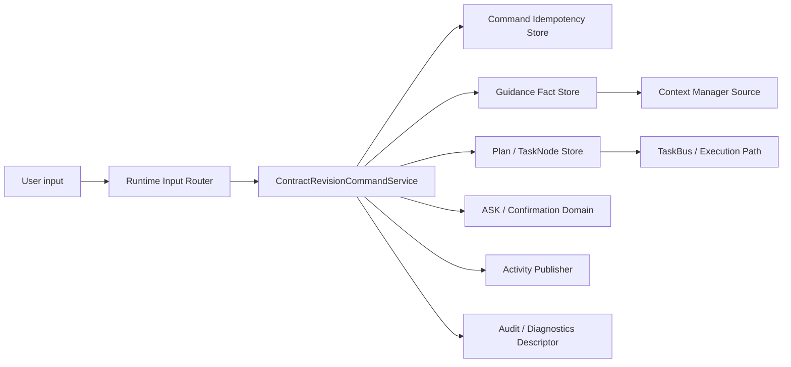
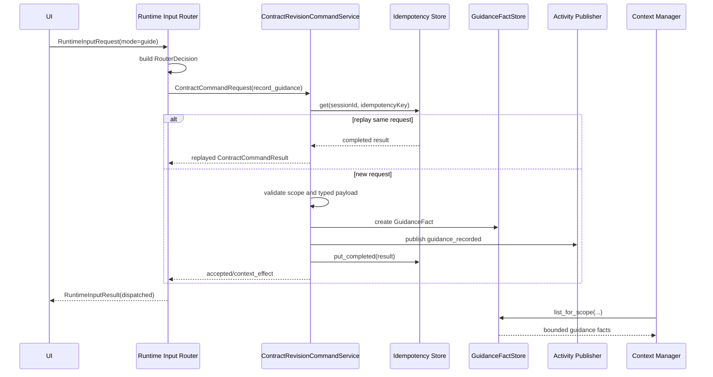
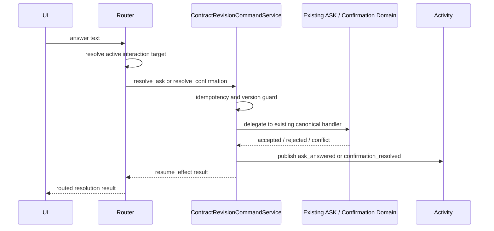
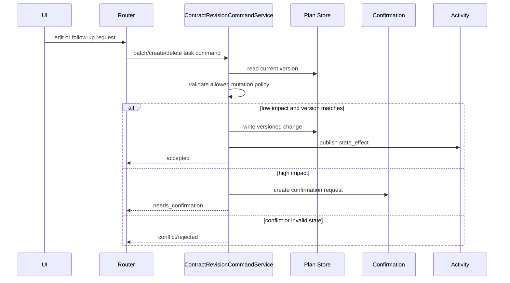

# Contract Revision Command Skills 中文详细技术方案

> Status: 中文技术方案已更新；CRS-A 至 CRS-E 已在分支实现；
> targeted unit/router/sidecar tests 已通过，仍需 PR 收敛和外部 CI 验证
>
> Last Updated: 2026-06-18
>
> Feature Plan:
> [Contract Revision Command Skills](contract-revision-command-skills.md)
>
> Product Inputs:
> [Product 1.1 Open Work](../../product/plato-1-1-open-work.md),
> [Plato Contract Loop Product Model](../../product/plato-contract-loop-model.md),
> [Plato Runtime Input Model](../../product/plato-runtime-input-model.md),
> [Plato Session Content Model](../../product/plato-session-content-model.md)
>
> Engineering Inputs:
> [Runtime Input Router Contract](runtime-input-router-contract.md),
> [Runtime Input Router Technical Design](runtime-input-router-contract-technical-design.md),
> [Runtime Input And Contract Revision Program](runtime-input-and-contract-revision-program.md),
> [Session Conversation / Activity Timeline](session-conversation-activity-timeline.md),
> [Plan / TaskNode Contract Migration](plan-tasknode-contract-migration.md)

---

## 1. 目标

本方案把 Contract Revision Command Skills 落到可实现的后端技术边界。

Product 1.1 的 P0 已经收敛为：

```text
Runtime Input Router
  + Contract Revision Command Skills
  + durable Activity / Audit evidence
```

Runtime Input Router 负责判断用户输入的意图；Contract Revision Command
Skills 负责所有产品状态副作用。Router 不直接修改 Plan、TaskNode、ASK、
confirmation、TaskBus 或 workspace 文件。

本方案覆盖 P0 的完整技术目标：

1. 定义统一的 command request envelope 和 command result shape。
2. 定义命令级 idempotency、version guard、conflict、noop、rejected 和
   unsupported 语义。
3. 让 `record_guidance` 把用户指导保存为 typed context fact，而不是隐藏在
   chat/message 中。
4. 让 `resolve_ask`、`resolve_confirmation` 复用现有 ASK / confirmation
   domain lifecycle，使运行时提问和显式 UI 操作具备同一语义。
5. 让 `patch_task_node`、`create_task_node`、`delete_task_node` 通过
   PlanStore / PlanTaskNode 的版本化合同写入产品状态。
6. 让 `create_execution_task` 把 workspace-changing 输入转换为 executable
   contract work，但不直接运行 shell、file tools、browser、search 或 fetch。
7. 确保每个 accepted command 都有 durable Activity、Audit ref 和 diagnostics
   descriptor。
8. 给 Runtime Input Router 提供清晰的 side-effect boundary：Router 只判定和分发，
   Command Skills 才能改变产品状态。

## 2. 非目标

- 不实现公开 skill marketplace。
- 不实现用户自定义 skill authoring UI。
- 不实现 MCP tool execution。
- 不实现 browser automation。
- 不实现通用 Router Agent。
- 不允许 prompt-only state mutation。
- 不允许 Router 直接写 workspace 文件或运行 shell。
- 不替换现有 ASK / confirmation / TaskBus 领域机制。
- 不把 Activity 当作 canonical store；Activity 只解释 canonical facts。

## 3. 当前接入点

已有代码提供了可复用边界：

| 现有模块 | 当前职责 | 本方案用法 |
|---|---|---|
| `taskweavn.server.ui_contract.runtime_input` | Runtime Input Router request/result/decision 合同。 | command skills 接收 `routerDecisionId`，并返回 Router 可投影的 result refs。 |
| `taskweavn.server.runtime_input_router` | deterministic Router foundation。 | 增加 command skill service 依赖，接入 guidance、ASK/confirmation resolution、TaskNode mutation 和 execution handoff。 |
| `taskweavn.server.ui_contract.commands` | UI command payloads。 | 不直接承载所有 Contract Revision domain model；必要时只加 UI adapter payload。 |
| `taskweavn.server.ui_contract.command_gateway` | UI command gateway 编排。 | 继续承载显式 UI 命令；Router-dispatched contract commands 应经新 service，再按需调用现有 gateway/domain service。 |
| `taskweavn.server.ui_command_idempotency` | HTTP UI command response 级 idempotency。 | 可复用思想，但 command skills 需要领域命令级 idempotency，避免只缓存 HTTP response。 |
| `taskweavn.server.runtime_input_activity` | Router answer Activity 持久化 seam。 | 扩展为 Router command outcome Activity publisher，或新增专用 publisher。 |
| `taskweavn.server.ui_contract.session_activity_projection` | typed Activity projection。 | 增加 `guidance_recorded`、`ask_answered`、`confirmation_resolved`、`task_changed`、`task_created`、`task_removed` 等 Router command facts 的投影来源。 |
| `taskweavn.task.plan_models` | durable Plan / PlanTaskNode。 | Plan/TaskNode command 的 canonical model。 |
| `taskweavn.task.plan_stores` / `sqlite_plan_store` | durable Plan store。 | TaskNode patch/create/delete 和 execution handoff 的存储边界。 |
| `taskweavn.interaction` / ASK stores | ASK domain。 | `resolve_ask` 只委托现有 ASK command lifecycle。 |
| `taskweavn.context` | Context Manager。 | `record_guidance` 写入 typed guidance 后，由 ContextSource 按 scope 和 budget 进入上下文。 |

设计原则：

```text
不要新增绕过现有 domain store / Context Manager / Activity projection 的
隐藏状态通道。
```

## 4. 建议模块边界

后端包边界：

```text
src/taskweavn/contract_revision/
  __init__.py
  models.py
  service.py
  idempotency_store.py
  sqlite_idempotency_store.py
  guidance_store.py
  sqlite_guidance_store.py
  guidance_commands.py
  tasknode_commands.py
  interaction_commands.py
  execution_handoff.py
  activity.py
  diagnostics.py
```

当前设计不把所有逻辑塞进 `server/runtime_input_router.py` 或
`server/ui_contract/command_gateway.py`。Router 是 dispatcher，UI command
gateway 是显式 UI command facade；Contract Revision Command Skills 是独立的
产品领域能力层，供 Router 和显式 UI 命令复用。

模块责任划分如下：

| 模块 | 责任 | 当前状态 |
|---|---|---|
| `models.py` | command envelope/result/payload/descriptor 数据合同。 | 已实现 |
| `service.py` | command dispatch、idempotency、result assembly、Activity publish 编排。 | 已实现并扩展中 |
| `idempotency_store.py` / `sqlite_idempotency_store.py` | command 级 replay/conflict guard。 | 已实现 |
| `guidance_store.py` / `sqlite_guidance_store.py` | typed guidance fact canonical store。 | 已实现 |
| `guidance_commands.py` | guidance validation / persistence helper。 | 已实现 |
| `interaction_commands.py` | ASK / confirmation routed resolution adapter。 | 已实现 |
| `tasknode_commands.py` | TaskNode patch/create/delete 和 execution handoff adapter。 | 已实现，targeted tests 已覆盖 |
| `activity.py` | command result 到 durable Activity fact 的投影。 | 已实现并扩展中 |
| `diagnostics.py` | redacted diagnostic descriptor。 | 可继续拆分；当前主要在 service helpers 内 |
| `execution_handoff.py` | 可选独立模块，用于后续从 TaskNode 创建扩展到 publish/execute handoff。 | planned |

最小 P0 实现包：

```text
models.py
service.py
idempotency_store.py
sqlite_idempotency_store.py
guidance_store.py
sqlite_guidance_store.py
guidance_commands.py
interaction_commands.py
tasknode_commands.py
activity.py
diagnostics.py
```

其中 `diagnostics.py` 可以先以内聚 helper 形式存在于 `service.py`，但模型和导出
字段必须保持本文定义的 redaction 规则。

### 4.1 架构总览



这张图表达三个约束：

1. Router 只做意图判断和分发，不直接修改产品状态。
2. Command Service 是唯一的 contract-revision side-effect boundary。
3. Activity、Audit、diagnostics 解释 canonical facts，但不替代 canonical store。

### 4.2 关键时序

`record_guidance` 第一阶段时序：



ASK / confirmation 后续阶段时序：



Plan / TaskNode mutation 后续阶段时序：



## 5. 核心数据模型

模型风格应沿用 `UiContractModel` / Pydantic 严格合同风格：

- `extra="forbid"`；
- 字段显式；
- Literal status；
- JSON-safe；
- 不存 raw provider payload、absolute path、tool args、SQLite row、secret。

### 5.1 Literal Types

建议 literal：

```python
ContractCommandKind = Literal[
    "record_guidance",
    "patch_task_node",
    "create_task_node",
    "delete_task_node",
    "create_execution_task",
    "resolve_ask",
    "resolve_confirmation",
]

ContractCommandStatus = Literal[
    "accepted",
    "rejected",
    "needs_confirmation",
    "conflict",
    "noop",
    "unsupported",
]

ContractCommandScopeKind = Literal[
    "session",
    "plan",
    "task",
    "ask",
    "confirmation",
]

ContractCommandSource = Literal[
    "runtime_input",
    "explicit_ui",
    "system_recovery",
    "test_fixture",
]
```

`sideEffect` 直接复用 Activity 合同中的语义：

```python
SessionActivitySideEffect = Literal[
    "no_effect",
    "context_effect",
    "state_effect",
    "authorization_effect",
    "resume_effect",
    "execution_request",
    "evidence_effect",
]
```

### 5.2 Command Request Envelope

所有 command skills 接收同一个 envelope：

```python
class ContractCommandRequest(ContractRevisionModel):
    command_id: str
    idempotency_key: str
    command_kind: ContractCommandKind
    workspace_id: str
    session_id: str
    scope_kind: ContractCommandScopeKind
    plan_id: str | None = None
    task_node_id: str | None = None
    ask_id: str | None = None
    confirmation_id: str | None = None
    source: ContractCommandSource
    router_decision_id: str | None = None
    input_message_ref: ObjectRef | None = None
    expected_version: int | None = None
    payload: dict[str, object]
```

关键规则：

1. `command_id` 是本次尝试 id。
2. `idempotency_key` 是副作用 replay guard。Router dispatch 必须提供。
3. `router_decision_id` 只在 Runtime Input Router 触发时需要。
4. `expected_version` 用于 Plan、TaskNode、ASK、confirmation 版本检查。
5. `payload` 进入具体 command handler 后必须再解析成 typed payload。
6. envelope 不携带 raw diagnostic payload。

### 5.3 Command Result Shape

```python
class ContractCommandResult(ContractRevisionModel):
    command_id: str
    idempotency_key: str
    command_kind: ContractCommandKind
    status: ContractCommandStatus
    side_effect: SessionActivitySideEffect
    scope_kind: ContractCommandScopeKind
    session_id: str
    plan_id: str | None = None
    task_node_id: str | None = None
    refs: tuple[SessionActivityRefView, ...] = ()
    activity: ContractCommandActivityDescriptor | None = None
    audit: ContractCommandAuditDescriptor | None = None
    diagnostics: ContractCommandDiagnosticDescriptor | None = None
    new_version: int | None = None
    reason_code: str | None = None
    message_key: str | None = None
```

状态含义：

| Status | 含义 | 是否允许副作用 |
|---|---|---:|
| `accepted` | command 已写入 canonical facts。 | yes |
| `noop` | command 与已有状态一致，没有新写入。 | no new effect |
| `needs_confirmation` | 需要用户确认后才能写入。 | only authorization request |
| `conflict` | version/idempotency/state 冲突。 | no |
| `rejected` | 目标不存在、状态非法、payload 不合法。 | no |
| `unsupported` | route 被识别但能力未实现。 | no |

`activity`、`audit`、`diagnostics` 是 descriptor，不是 canonical state。
它们用于投影、链接和导出。

## 6. Idempotency 设计

HTTP idempotency 只能保证 HTTP response replay，不足以保证内部 command
side effect replay。Contract Revision Command Skills 需要领域级 store。

建议接口：

```python
class ContractCommandIdempotencyStore(Protocol):
    def get(
        self,
        session_id: str,
        idempotency_key: str,
    ) -> ContractCommandRecord | None: ...

    def put_started(
        self,
        request: ContractCommandRequest,
        request_hash: str,
    ) -> ContractCommandRecord: ...

    def put_completed(
        self,
        request: ContractCommandRequest,
        request_hash: str,
        result: ContractCommandResult,
    ) -> ContractCommandRecord: ...
```

SQLite 表建议：

```sql
CREATE TABLE IF NOT EXISTS contract_revision_command_records (
    session_id TEXT NOT NULL,
    idempotency_key TEXT NOT NULL,
    command_id TEXT NOT NULL,
    command_kind TEXT NOT NULL,
    request_hash TEXT NOT NULL,
    status TEXT NOT NULL,
    result_json TEXT,
    created_at TEXT NOT NULL,
    completed_at TEXT,
    PRIMARY KEY (session_id, idempotency_key)
);
```

规则：

1. 相同 `(session_id, idempotency_key)` + 相同 `request_hash` 返回原 result。
2. 相同 key + 不同 hash 返回 `conflict`。
3. started 但未 completed 的记录应返回 retryable conflict 或由实现定义
   recovery policy，不能重新执行副作用。
4. `noop` 和 `rejected` 也应可 replay，避免用户重复提交造成不一致提示。

## 7. Guidance Fact 设计

### 7.1 为什么第一步做 `record_guidance`

Product 1.1 的一个核心问题是：用户并不总是在“下命令”，他们经常是在补充
偏好、限制、纠正和上下文。当前这类输入容易被当成普通 chat/message，导致：

- 后续 Context Manager 不知道它的作用域；
- Activity 无法解释“这句话改变了什么”；
- Audit/diagnostics 无法说明为什么 Agent 后续行为改变；
- Router 的 guidance route 只能返回 unsupported。

`record_guidance` 是最小的 command-backed context effect。

### 7.2 Guidance 模型

```python
GuidanceKind = Literal[
    "preference",
    "constraint",
    "instruction",
    "correction",
    "context_note",
]

class GuidanceFact(ContractRevisionModel):
    guidance_id: str
    workspace_id: str
    session_id: str
    scope_kind: Literal["session", "plan", "task"]
    plan_id: str | None = None
    task_node_id: str | None = None
    guidance_kind: GuidanceKind
    guidance_text: str
    applies_to_future_tasks: bool = False
    source_command_id: str
    source_router_decision_id: str | None = None
    source_message_ref: ObjectRef | None = None
    version: int = 1
    created_at: datetime
    archived_at: datetime | None = None
```

### 7.3 Guidance Store

建议接口：

```python
class GuidanceFactStore(Protocol):
    def create(self, fact: GuidanceFact) -> GuidanceFact: ...

    def get(self, session_id: str, guidance_id: str) -> GuidanceFact | None: ...

    def list_for_scope(
        self,
        *,
        session_id: str,
        plan_id: str | None = None,
        task_node_id: str | None = None,
        include_archived: bool = False,
        limit: int = 50,
    ) -> tuple[GuidanceFact, ...]: ...
```

SQLite 表建议：

```sql
CREATE TABLE IF NOT EXISTS guidance_facts (
    guidance_id TEXT PRIMARY KEY,
    workspace_id TEXT NOT NULL,
    session_id TEXT NOT NULL,
    scope_kind TEXT NOT NULL,
    plan_id TEXT,
    task_node_id TEXT,
    guidance_kind TEXT NOT NULL,
    guidance_text TEXT NOT NULL,
    applies_to_future_tasks INTEGER NOT NULL DEFAULT 0,
    source_command_id TEXT NOT NULL,
    source_router_decision_id TEXT,
    source_message_ref_json TEXT,
    version INTEGER NOT NULL,
    created_at TEXT NOT NULL,
    archived_at TEXT
);

CREATE INDEX IF NOT EXISTS idx_guidance_facts_session_scope_created
    ON guidance_facts(session_id, scope_kind, plan_id, task_node_id, created_at);
```

### 7.4 `record_guidance` 流程

```text
Router(mode=guide or guidance intent)
  -> ContractRevisionCommandService.execute(record_guidance)
  -> idempotency check
  -> validate scope
  -> GuidanceFactStore.create
  -> command result accepted/context_effect
  -> Activity publisher writes guidance_recorded
  -> Router returns dispatched result
```

Validation：

- `session_id` 必须存在于当前 workspace runtime。
- `scope_kind=session` 不需要 Plan/Task。
- `scope_kind=plan` 必须有 `plan_id`，且 Plan 属于 session。
- `scope_kind=task` 必须有 `task_node_id`，且 TaskNode 属于 Plan/session。
- `guidance_text.strip()` 非空，长度受限。
- `guidance_kind` 必须是稳定 literal。
- idempotent replay 不创建重复 fact。

Result：

- `status=accepted`
- `side_effect=context_effect`
- `activity.kind=guidance_recorded`
- `source_kind=router` if routed
- `refs` 至少包含 session/plan/task scope ref 和 diagnostic/audit ref。

## 8. Context Manager 接入

第一阶段不应该把 guidance 直接拼到 prompt。应新增一个 Context Source：

```text
GuidanceFactStore
  -> ContractGuidanceContextSource
  -> SessionContextManager
  -> TaskExecutionContextV0
  -> renderer
```

Context inclusion policy：

| Scope | 进入哪些上下文 | 默认 |
|---|---|---|
| session guidance | 当前 session 的 authoring/execution context | yes, bounded |
| plan guidance | 当前 active Plan authoring/execution context | yes |
| task guidance | 目标 Task execution context | yes |
| applies_to_future_tasks | follow-up authoring context | yes, bounded |
| archived guidance | 不进入 normal context | no |

Trace 要求：

- ContextTrace 应记录 guidance candidate count、included count、truncated count。
- 每条 included guidance 应有 stable ref/hash，不暴露 hidden store row。
- diagnostics 只导出 safe summary 和 redacted/truncated text。

## 9. Runtime Input Router 集成

`DefaultRuntimeInputRouter` 当前在 `mode == "guide"` 时返回 unsupported。
CRS-B 完成后改为：

```text
if request.mode == "guide" or guidance intent:
    if contract_revision_service is None:
        return unsupported(no mutation)
    return _record_guidance(request)
```

Router 到 command service 的映射：

| Router field | Command request field |
|---|---|
| `request.command_id` | `command_id` |
| `request.command_id` or derived key | `idempotency_key` |
| `request.workspace_id` | `workspace_id` |
| `request.session_id` | `session_id` |
| `decision.id` | `router_decision_id` |
| `request.selection.scope_kind` | `scope_kind` |
| `request.selection.plan_id` | `plan_id` |
| `request.selection.task_node_id` | `task_node_id` |
| `request.content` | `payload.guidance_text` |
| `request.mode` / classifier output | `payload.guidance_kind` |

Router result：

- `decision.dispatchTarget="record_guidance"`
- `decision.sideEffect="context_effect"`
- `outcome.status="dispatched"`
- `commandResponse` 可为空或承载 adapter response，但必须有 `activity`
  或可 durable replay 的 activity ref。

为了减少前端破坏，第一步可以让 Router response 返回
`SessionActivityItemView`，同时 Activity publisher 写入 durable MessageStream
或后续专门 store。

## 10. Activity 设计

现有 `SessionActivityItemKind` 已包含：

- `guidance_recorded`
- `ask_answered`
- `confirmation_resolved`
- `router_interpretation`

第一阶段建议：

1. 扩展 `RuntimeInputActivityPublisher` 或新增
   `ContractRevisionActivityPublisher`。
2. 先用 MessageStream 存 Activity-compatible facts，和 read-only inquiry
   的实现路线保持一致。
3. `DefaultSessionActivityProjectionService` 从 message context 中识别
   `runtime_input_activity_kind="guidance_recorded"` 并投影。

建议 message context：

```json
{
  "runtime_input_activity_kind": "guidance_recorded",
  "runtime_input_side_effect": "context_effect",
  "runtime_input_decision_id": "rir-...",
  "contract_command_id": "cmd-...",
  "contract_command_kind": "record_guidance",
  "guidance_id": "guidance-...",
  "activity_related_refs": []
}
```

Activity 展示：

| Field | 值 |
|---|---|
| `kind` | `guidance_recorded` |
| `title` | UI text key 映射，例如 `activity.guidanceRecorded.title` |
| `body` | guidance 摘要，按长度截断 |
| `scopeKind` | session / plan / task |
| `sideEffect` | `context_effect` |
| `sourceKind` | `router` |
| `sourceId` | `routerDecisionId` 或 `commandId` |

## 11. Audit / Diagnostics 设计

每个 accepted command 产生安全 descriptor。

### 11.1 Audit Descriptor

```python
class ContractCommandAuditDescriptor(ContractRevisionModel):
    command_id: str
    command_kind: ContractCommandKind
    status: ContractCommandStatus
    side_effect: SessionActivitySideEffect
    session_id: str
    plan_id: str | None = None
    task_node_id: str | None = None
    target_ref: ObjectRef | None = None
    summary: str
    safe_before_after: tuple[ContractFieldChangeSummary, ...] = ()
```

`record_guidance` 的 audit summary 不需要完整泄露 guidance 文本。可以记录：

- guidance kind；
- scope；
- length；
- truncated preview；
- source router decision；
- command id。

### 11.2 Diagnostic Descriptor

Diagnostics 必须避免：

- secrets；
- provider payload；
- raw prompt；
- raw EventStream rows；
- SQLite rows；
- absolute workspace paths；
- unbounded guidance text。

建议导出字段：

```json
{
  "kind": "contract_revision_command",
  "commandKind": "record_guidance",
  "status": "accepted",
  "sideEffect": "context_effect",
  "scopeKind": "task",
  "hasGuidanceText": true,
  "guidancePreview": "short redacted preview",
  "truncated": true,
  "routerDecisionId": "rir-..."
}
```

## 12. ASK / Confirmation Routed Resolution

CRS-C 不应重写 ASK/confirmation domain。

设计：

```text
Router active interaction route
  -> ContractRevisionCommandService
  -> resolve_ask / resolve_confirmation adapter
  -> existing UiCommandGateway / domain command
  -> Activity ask_answered / confirmation_resolved
```

规则：

- explicit UI answer 和 routed input answer 必须共享同一 canonical handler。
- repeated answer 必须 idempotent，不能 double resume。
- answer shape 不匹配时返回 `rejected` 或 clarification。
- active interaction state 由 backend authoritative projection 决定，不能只信 clientState。

## 13. Command Skill API Surface

P0 command set 固定为七个内部命令：

| Command | Scope | Side effect | Canonical owner | 当前状态 |
|---|---|---|---|---|
| `record_guidance` | session / plan / task | `context_effect` | GuidanceFactStore | implemented |
| `resolve_ask` | ask | `resume_effect` | ASK domain | implemented |
| `resolve_confirmation` | confirmation | `authorization_effect` | confirmation domain | implemented |
| `patch_task_node` | task | `state_effect` | PlanStore / existing UI command gateway | implemented |
| `create_task_node` | plan | `state_effect` | PlanStore | implemented |
| `delete_task_node` | task | `state_effect` or `noop` | PlanStore tombstone | implemented |
| `create_execution_task` | session / plan | `state_effect` first, later `execution_request` | PlanStore, then publish/TaskBus path | implemented |

设计要求：

1. Router 不直接写任何 canonical store。
2. Command Service 是所有 Runtime Input product-state side effect 的唯一入口。
3. 每个 command 必须解析 typed payload，不能把 raw `dict` 透传到 store。
4. 每个 command 必须经过 command-level idempotency store。
5. 每个 accepted command 必须返回 refs、Activity descriptor、Audit descriptor 和
   diagnostics descriptor。
6. 每个 rejected/conflict/unsupported command 必须返回稳定 `reasonCode` 和
   `messageKey`。

### 13.1 Payload Contracts

#### `record_guidance`

```python
class RecordGuidancePayload(ContractRevisionModel):
    guidance_text: str
    guidance_kind: GuidanceKind = "instruction"
    applies_to_future_tasks: bool = False
    expires_at: datetime | None = None
```

约束：

- text trim 后不能为空；
- text 进入 canonical GuidanceFact，但 diagnostics 只保留 preview / truncated 标记；
- `expires_at` 是合同字段，P0 可以先不执行自动归档。

#### `resolve_ask`

```python
class ResolveAskPayload(ContractRevisionModel):
    selected_option_ids: tuple[str, ...] = ()
    text: str | None = None
```

约束：

- option 和 text 至少提供一个；
- command handler 只做 adapter，具体 ASK answer lifecycle 仍由 ASK domain 决定；
- repeated answer 必须 replay，不允许 double resume。

#### `resolve_confirmation`

```python
class ResolveConfirmationContractPayload(ContractRevisionModel):
    value: str
    note: str | None = None
```

约束：

- `value` 必须映射到 existing confirmation domain 支持的 accept/reject/cancel 等语义；
- 不在 Contract Revision 层重写 confirmation 状态机。

#### `patch_task_node`

```python
class PatchTaskNodePayload(ContractRevisionModel):
    title: str | None = None
    summary: str | None = None
    intent: str | None = None
    full_intent: str | None = None
    constraints: tuple[str, ...] | None = None
    update_mode: Literal["node_fields", "replace_children", "replace_subtree"]
    preserve_root_id: bool = True
```

约束：

- 至少有一个字段被修改；
- `intent` 和 `full_intent` 不能同时提供；
- P0 默认通过现有 `update_task_node` gateway 执行，以复用已有 version guard 和
  UI command response shape。

#### `create_task_node`

```python
class CreateTaskNodePayload(ContractRevisionModel):
    title: str
    intent: str
    summary: str | None = None
    instructions: str = ""
    required_capability: str | None = "general"
    constraints: tuple[str, ...] = ()
    acceptance_criteria: tuple[str, ...] = ()
    depends_on: tuple[str, ...] = ()
    after_task_node_id: str | None = None
```

约束：

- 只能写入 editable Plan；
- `after_task_node_id` 不存在时插入末尾；
- `after_task_node_id` 存在但找不到时返回 `rejected/invalid_payload`；
- replay 不能重复创建 TaskNode。

#### `delete_task_node`

```python
class DeleteTaskNodePayload(ContractRevisionModel):
    reason: str | None = None
```

约束：

- P0 不做物理删除；
- 没有 execution evidence 的节点可以 tombstone；
- 已 published、已执行、已有 result/error/file/audit ref 的节点拒绝删除；
- 已 tombstone 的重复请求返回 `noop`。

#### `create_execution_task`

```python
class CreateExecutionTaskPayload(ContractRevisionModel):
    intent: str
    title: str | None = None
    summary: str | None = None
    instructions: str = ""
    required_capability: str | None = "general"
    constraints: tuple[str, ...] = ()
    acceptance_criteria: tuple[str, ...] = ()
```

约束：

- 将 workspace-changing input 转换为 executable TaskNode；
- 不直接触发 workspace mutation；
- 如果存在 editable active Plan，则追加 approved TaskNode；
- 如果没有 editable active Plan，且 request 未指定不可编辑目标 Plan，则创建一个
  approved single-task Plan；
- 如果 request 指定了 non-editable Plan，返回 `rejected/invalid_plan_state`。

## 14. Plan / TaskNode Mutation Commands

### 14.1 Editable Plan Policy

P0 只允许以下 Plan status 被 command skills 修改：

```text
draft
reviewing
approved
```

不可编辑状态：

```text
published
running
completed
cancelled
failed
unknown future status
```

规则：

1. 显式 `plan_id` 优先；如果 target Plan 不存在，返回
   `rejected/target_not_found`。
2. 显式 `plan_id` 对应 Plan 不可编辑时，返回
   `rejected/invalid_plan_state`。
3. 未提供 `plan_id` 时，`create_task_node` 查找 active editable Plan；没有则拒绝。
4. 未提供 `plan_id` 时，`create_execution_task` 可以创建新的 approved Plan。
5. 所有 PlanStore 写入都必须使用 expected version 或 store 自身 version guard。

### 14.2 `patch_task_node` Flow

```text
ContractCommandRequest(patch_task_node)
  -> ContractRevisionCommandService._patch_task_node
  -> PatchTaskNodePayload validation
  -> ContractTaskNodeCommandHandler.patch_task_node
  -> UiCommandGateway.update_task_node
  -> existing TaskNode version / state validation
  -> CommandResponse
  -> ContractCommandResult(state_effect)
  -> Activity task_changed
```

为什么先复用 UI command gateway：

- 现有 gateway 已经掌握 TaskRef resolution；
- 现有 gateway 已经有 TaskNode expected version guard；
- 可以避免同一字段更新在两个 domain handler 中分叉；
- Contract Revision 层只负责统一 envelope、Activity/Audit 和 routed input 入口。

后续可拆分条件：

- `patch_task_node` 需要支持更复杂的 subtree mutation；
- explicit UI command 和 routed command 都能迁移到同一个 domain-level
  TaskNodeCommandService；
- 现有 gateway 变成 adapter，而不是 command owner。

### 14.3 `create_task_node` Flow

```text
ContractCommandRequest(create_task_node)
  -> validate payload
  -> resolve editable target Plan
  -> list existing PlanTaskNode
  -> compute task_index and order_index
  -> PlanStore.add_task_node(expected_plan_version)
  -> ContractCommandResult(state_effect, refs: plan/task)
  -> Activity task_created
```

Task index 规则：

- 从已有 `task_index` 集合中找最小可用正整数；
- 使用字符串存储，保持和现有 PlanTaskNode model 兼容；
- 不复用已取消节点的 `task_index`，除非后续产品明确允许。

Order index 规则：

- 未指定 `after_task_node_id`：`max(order_index) + 1`；
- 空 Plan：`0`；
- 指定 `after_task_node_id`：目标节点 `order_index + 1`；
- 如果产生相同 `order_index`，由后续排序归一化或 PlanStore 规则处理；
- P0 不做批量 reorder，避免隐式改动其他节点。

Readiness / execution 初始值：

| Command | readiness | execution |
|---|---|---|
| `create_task_node` | `draft` | model default |
| `create_execution_task` | `approved` | model default |

### 14.4 `delete_task_node` Tombstone Flow

```text
ContractCommandRequest(delete_task_node)
  -> validate task target
  -> get PlanTaskNode
  -> if already cancelled: noop
  -> check execution evidence
  -> PlanStore.save_task_node(readiness=cancelled, execution=cancelled)
  -> ContractCommandResult(state_effect)
  -> Activity task_removed
```

删除不是物理删除。P0 tombstone 写入：

```text
readiness = cancelled
execution = cancelled
```

拒绝删除条件：

| 条件 | reasonCode |
|---|---|
| TaskNode 不存在 | `target_not_found` |
| TaskNode 已 published 或有 `published_ref` | `task_already_published` |
| `execution` 不是 `not_started` / `unknown` | `task_has_execution_evidence` |
| 有 `result_ref` / `error_ref` / `file_summary_ref` / `audit_ref` | `task_has_execution_evidence` |
| expected version 不匹配 | `version_conflict` |

用户体验规则：

- Activity 应显示为“Task removed”，但详情可以解释为取消/移除出当前计划；
- Audit 需要保留 target Task ref；
- Main Page 计划列表是否隐藏 cancelled 节点由 projection 层决定，不由 command
  层物理删除。

### 14.5 Version Guard

所有 mutation command 都必须遵守：

1. 修改已有 TaskNode 时使用 `expected_version` 或当前 node version。
2. 向 Plan 添加节点时使用 `expected_plan_version`，避免并发插入覆盖。
3. `VersionConflictError` 必须投影为 `conflict/version_conflict`，不应投影成普通
   rejected。
4. Router 不能自动重试有副作用的 mutation；UI 应提示用户刷新或重新提交。

当前实现要求：

- `_failure_from_exception(VersionConflictError)` 返回 `status="conflict"` 和
  `reason_code="version_conflict"`；
- 已 tombstone Task 的重复删除返回 `status="noop"`，不生成新的 state effect。

## 15. Execution Request Handoff

`create_execution_task` 是解决 Runtime Input `mode=change` 的关键命令。它的目标是
把“用户希望 Plato 修改 workspace”的自然语言输入变成可审计、可发布、可执行的
contract work。

### 15.1 Boundary

禁止：

- 直接调用 shell；
- 直接调用 precision file tools；
- 直接调用 browser automation；
- 直接调用 web search / web fetch；
- 绕过 Plan/TaskNode 直接写 workspace；
- 在 Router 中隐式执行任务。

允许：

```text
workspace-changing input
  -> Runtime Input Router classifies mode=change
  -> ContractRevisionCommandService(create_execution_task)
  -> create approved executable TaskNode
  -> Activity task_created
  -> user reviews / publishes / executes through existing path
  -> TaskBus owns workspace mutation
```

### 15.2 Plan Resolution

| Input state | Behavior |
|---|---|
| request has editable `plan_id` | append approved TaskNode to that Plan |
| request has non-editable `plan_id` | reject `invalid_plan_state` |
| no `plan_id`, editable active Plan exists | append approved TaskNode to active Plan |
| no `plan_id`, no active editable Plan | create approved single-task Plan |
| no `plan_id`, active Plan exists but non-editable | create new approved single-task Plan only if product policy allows; otherwise reject |

P0 建议保守策略：

- 显式目标不可编辑时必须拒绝；
- 没有显式目标时允许创建新 Plan，因为用户表达的是新的 workspace-changing request；
- 新 Plan 的 `created_by` 标记为 `runtime_input_router`。

### 15.3 TaskNode Creation Rules

新 TaskNode：

- `title` 来自 payload title；没有 title 时，从 intent 截断生成；
- `intent` 保存完整用户目标；
- `summary` 默认等于 intent；
- `required_capability` 默认 `general`；
- `acceptance_criteria` 为空时给出最小 criteria：
  `Complete the requested workspace change.`；
- `readiness=approved`，表示可进入后续 publish/execute path；
- 不自动设置 `published_ref`；
- 不自动设置 running/done；
- 不创建文件、diff 或 result。

### 15.4 Side Effect Semantics

P0 `create_execution_task` 的实际 side effect 是 `state_effect`，因为它只修改
Plan/TaskNode contract。

只有当后续实现把命令推进到 accepted publish/execute path，并且 TaskBus 已经接受
执行请求时，才允许返回：

```text
side_effect = execution_request
```

这能防止 UI 误以为“任务已经执行”，也避免用户输入一发送就修改 workspace。

### 15.5 Router Integration

Runtime Input Router 映射：

| Router condition | Command |
|---|---|
| `mode == "guide"` | `record_guidance` |
| active pending ASK | `resolve_ask` |
| active pending confirmation | `resolve_confirmation` |
| stop phrase | existing stop selected task command |
| retry phrase | existing retry selected task command |
| `mode == "ask"` or question-like | read-only inquiry |
| `mode == "change"` or workspace-change-like | `create_execution_task` |
| unknown | unsupported/no mutation |

`mode=change` result：

- accepted: `RuntimeInputOutcome.status="dispatched"`；
- rejected: `RuntimeInputOutcome.status="rejected"`；
- user message 必须明确“没有直接修改 workspace 文件”；
- Activity kind 为 `task_created`；
- refs 至少包含 Plan/Task ref。

## 16. Activity / Audit / Diagnostics Evidence

### 16.1 Activity Mapping

| Command | Activity kind | Title | Side effect |
|---|---|---|---|
| `record_guidance` | `guidance_recorded` | Guidance recorded | `context_effect` |
| `resolve_ask` | `ask_answered` | ASK answered | `resume_effect` |
| `resolve_confirmation` | `confirmation_resolved` | Confirmation resolved | `authorization_effect` |
| `patch_task_node` | `task_changed` | Task changed | `state_effect` |
| `create_task_node` | `task_created` | Task created | `state_effect` |
| `delete_task_node` | `task_removed` | Task removed | `state_effect` / `no_effect` on noop |
| `create_execution_task` | `task_created` | Execution work created | `state_effect` |

Activity 持久化规则：

1. Activity item 可以从 command result descriptor 生成。
2. Activity 必须包含 `source_kind="router"` 或显式 UI source。
3. Activity source id 优先使用 Router decision id，其次 command id。
4. Activity related refs 必须可聚焦到 Plan/Task/ASK/confirmation。
5. Activity 不是 canonical state；reload 时如果和 PlanStore 不一致，以 PlanStore 为准。

### 16.2 Audit Descriptor

每个 accepted command 生成：

```python
ContractCommandAuditDescriptor(
    command_id=...,
    command_kind=...,
    status="accepted",
    side_effect=...,
    scope_kind=...,
    session_id=...,
    plan_id=...,
    task_node_id=...,
    target_ref=...,
    summary=...,
)
```

Plan/TaskNode command 后续应扩展 `safe_before_after`：

```python
class ContractFieldChangeSummary(ContractRevisionModel):
    field: str
    before_preview: str | None
    after_preview: str | None
    redacted: bool = False
```

P0 如果暂未存完整 before/after，也必须至少记录：

- command id；
- command kind；
- affected plan/task id；
- status；
- side effect；
- stable reason code；
- safe summary。

### 16.3 Diagnostics Redaction

Diagnostics 可以包含：

- command kind；
- status；
- side effect；
- scope kind；
- reason code；
- router decision id；
- guidance preview；
- truncated flag；
- affected object ids。

Diagnostics 禁止包含：

- secrets / API keys；
- provider raw payload；
- raw prompt chain；
- raw EventStream rows；
- SQLite rows；
- absolute workspace paths；
- shell/tool args；
- unbounded user-authored content。

## 17. 错误和冲突语义

| 场景 | Result status | reasonCode | 是否副作用 |
|---|---|---|---:|
| 目标 session/Plan/Task/ASK/confirmation 不存在 | `rejected` | `target_not_found` | no |
| version 不匹配 | `conflict` | `version_conflict` | no |
| idempotency key 冲突 | `conflict` | `idempotency_conflict` | no |
| idempotency command 未完成 | `conflict` | `incomplete_idempotent_command` | no |
| payload 不合法 | `rejected` | `invalid_payload` | no |
| Plan 状态不允许 | `rejected` | `invalid_plan_state` | no |
| Task 已发布 | `rejected` | `task_already_published` | no |
| Task 已有执行证据 | `rejected` | `task_has_execution_evidence` | no |
| 需要用户确认 | `needs_confirmation` | `confirmation_required` | authorization only |
| 能力尚未实现 | `unsupported` | `unsupported_command` | no |
| replay 已完成命令 | original status | original reason | no new effect |
| 重复删除已 tombstone Task | `noop` | none or `already_cancelled` | no new effect |

UI 文案规则：

- 后端返回稳定 `messageKey`，前端用系统文案渲染；
- 后端 `message` 可以作为 fallback，但不应成为唯一文案来源；
- conflict 文案应提示刷新/重试；
- rejected 文案应说明没有修改产品状态或 workspace 文件；
- execution handoff 文案必须说明只是创建执行任务，不是已经执行。

## 18. 数据迁移、兼容和回滚

### 18.1 数据迁移

新增持久化：

1. `contract_revision_command_records`：命令级 idempotency 记录。
2. `guidance_facts`：用户指导事实。

复用持久化：

1. Plan / TaskNode store：TaskNode patch/create/delete/execution task。
2. ASK store：ASK resolution。
3. Confirmation domain store：confirmation resolution。
4. MessageStream / Activity projection：durable Activity facts。

迁移策略：

- workspace-local SQLite lazy migration；
- additive schema only；
- 不回填历史 chat/message 为 guidance；
- 不迁移历史 TaskNode 为 command records；
- 旧 workspace 打开时自动建表；
- 新表不可用时 Router 返回 structured unsupported/rejected，而不是静默失败。

### 18.2 兼容性

兼容要求：

- 没有注入 `ContractRevisionCommandService` 时，Router 必须 no mutation；
- explicit UI answer 和 routed answer 保持同一 domain behavior；
- old Activity projection 仍能展示原有 message/task/result；
- packaged Electron 和 `npm run electron:dev` 必须用同一 command semantics；
- 当前 schema 不要求用户删除旧 workspace 配置；
- 所有新 route 都必须有 unsupported fallback。

### 18.3 回滚

回滚开关：

1. 禁用 `contract_revision_service` 注入。
2. `mode=guide` 和 `mode=change` 回到 unsupported/no mutation。
3. ASK/confirmation 继续走 explicit UI path。
4. 已写入 guidance facts 保留，但 ContextSource 可暂停纳入上下文。
5. 已创建 TaskNode/Plan 保留，不反向删除。
6. Activity 保留为历史事实。

回滚不删除 SQLite 表，避免破坏审计链和未来恢复。

## 19. 测试方案

### 19.1 Unit Tests

建议覆盖文件：

```text
tests/test_contract_revision_models.py
tests/test_contract_revision_idempotency.py
tests/test_contract_revision_guidance_store.py
tests/test_contract_revision_record_guidance.py
tests/test_contract_revision_tasknode_commands.py
```

覆盖点：

- request/result model validation；
- unknown extra field forbidden；
- invalid payload rejected；
- idempotent replay；
- idempotency conflict；
- incomplete idempotent command conflict；
- diagnostics redaction；
- guidance create/list/get；
- Plan/Task scope validation；
- `patch_task_node` delegates to existing UI gateway；
- `create_task_node` appends to editable Plan；
- `create_task_node` rejects missing/non-editable Plan；
- `delete_task_node` tombstones unexecuted TaskNode；
- `delete_task_node` returns noop for already cancelled TaskNode；
- `delete_task_node` rejects published/executed/evidence-bearing TaskNode；
- `create_execution_task` appends approved TaskNode to editable Plan；
- `create_execution_task` creates approved single-task Plan when no active editable Plan；
- version conflict maps to `conflict/version_conflict`。

### 19.2 Router Integration Tests

建议覆盖文件：

```text
tests/test_runtime_input_router.py
tests/test_runtime_input_guidance_route.py
tests/test_runtime_input_execution_handoff.py
tests/test_session_activity_guidance_projection.py
tests/test_session_activity_contract_commands.py
```

覆盖点：

- `mode=guide` -> `record_guidance`；
- `mode=change` -> `create_execution_task`；
- active ASK -> `resolve_ask`；
- active confirmation -> `resolve_confirmation`；
- service 缺失时 structured unsupported/no mutation；
- rejected command 生成 recovery note，而不是 misleading success；
- accepted command 生成正确 Activity kind；
- Activity reload 后仍可见；
- Router result refs 与 command result refs 一致。

### 19.3 Store / Projection Tests

覆盖点：

- guidance facts survive reload；
- command idempotency records survive reload；
- session Activity projection 能识别：
  - `guidance_recorded`
  - `ask_answered`
  - `confirmation_resolved`
  - `task_changed`
  - `task_created`
  - `task_removed`
- cancelled TaskNode projection 不误报 running/done；
- Task refs 能打开 Details / Audit。

### 19.4 Sidecar / Electron Smoke

P0 验收前必须使用 Electron，而不是只看 web page：

1. `npm run electron:dev`：
   - guide 输入提交后按钮有反馈；
   - Activity 出现 guidance；
   - change 输入只创建 Task/Plan，不直接改文件；
   - ASK answer 可以恢复执行；
   - confirmation answer 可以进入正确路径。
2. packaged Electron：
   - sidecar 启动后 command service 注入；
   - guidance/TaskNode/ASK/confirmation survive reload；
   - no module/import missing；
   - diagnostics 不泄露 secrets/path。
3. installer smoke：
   - 安装后打开真实 app；
   - 创建 workspace；
   - 配置 LLM；
   - 发起 plan；
   - 触发 ASK；
   - 触发 mode=guide；
   - 触发 mode=change；
   - 查看 Activity/Audit。

### 19.5 Regression Tests

必须保留：

- existing task command tests；
- existing ASK service tests；
- existing UI contract mapping tests；
- main page sidecar app tests；
- multi-workspace sidecar tests；
- plato sidecar entry tests。

建议命令：

```text
uv run ruff check src/taskweavn/contract_revision src/taskweavn/server/runtime_input_router.py
uv run mypy src/taskweavn/contract_revision src/taskweavn/server/runtime_input_router.py
uv run pytest \
  tests/test_contract_revision_commands.py \
  tests/test_runtime_input_router.py \
  tests/test_task_commands.py \
  tests/test_task_ask_service.py \
  tests/test_ui_contract_mapping.py \
  tests/test_main_page_sidecar_app.py \
  tests/test_multi_workspace_sidecar.py \
  tests/test_plato_sidecar_entry.py
```

## 20. 实施顺序和状态

### CRS-A. Command Protocol

Status: implemented.

Deliverables：

1. `ContractCommandRequest`。
2. `ContractCommandResult`。
3. command kind/status/scope/source literals。
4. Activity/Audit/Diagnostics descriptors。
5. command idempotency store。

验收：

- accepted/rejected/conflict/noop/unsupported 均可表达；
- replay 不重复写 side effect；
- result 足够让 Router/UI 无需解析 prose。

### CRS-B. Guidance Command

Status: implemented.

Deliverables：

1. `GuidanceFact`。
2. SQLite guidance store。
3. `record_guidance` command。
4. Router `mode=guide` integration。
5. Activity `guidance_recorded`。
6. Context Manager inclusion metadata。

验收：

- session/plan/task guidance 可记录；
- reload 后 Activity 可见；
- Context Manager 可按 scope 获取；
- diagnostics redacted。

### CRS-C. ASK / Confirmation Routed Resolution

Status: implemented.

Deliverables：

1. `resolve_ask` adapter。
2. `resolve_confirmation` adapter。
3. active interaction Router path。
4. Activity `ask_answered` / `confirmation_resolved`。

验收：

- routed path 和 explicit UI path 共用 domain handler；
- repeated answer 不 double resume；
- invalid state structured rejected。

### CRS-D. Plan / TaskNode Mutation

Status: implemented; targeted tests passing.

Deliverables：

1. `patch_task_node`。
2. `create_task_node`。
3. `delete_task_node` tombstone。
4. version guard。
5. Plan-state guard。
6. Activity `task_changed` / `task_created` / `task_removed`。

待收敛：

- `order_index` 插入后是否需要归一化；
- cancelled TaskNode 在 Main Page projection 中如何展示或隐藏；
- destructive delete 是否需要二次 confirmation。

### CRS-E. Execution Request Handoff

Status: implemented; product acceptance and external CI pending.

Deliverables：

1. Router `mode=change` -> `create_execution_task`。
2. editable Plan append approved TaskNode。
3. no active editable Plan 时创建 approved single-task Plan。
4. Activity `task_created` / title `Execution work created`。
5. no workspace mutation guarantee。

待收敛：

- no-plan 创建新 Plan 的 UX 是否需要 confirmation；
- active non-editable Plan 且无 explicit `plan_id` 时，创建新 Plan 还是 reject；
- created approved TaskNode 是否自动进入 publish affordance；
- 后续 publish/execute handoff 是否返回 `execution_request`。

### CRS-F. Trust Closure

Status: partially implemented.

Deliverables：

1. Router decision ref。
2. command result refs。
3. Activity durable projection。
4. Audit descriptor。
5. diagnostics redaction。
6. Activity/Audit/File/Task focus links。

待收敛：

- Audit page 是否展示 command descriptor；
- diagnostics export 是否包含 command records；
- Activity projection 不应只依赖 title 字符串推断 kind，后续应使用 stable metadata。

## 21. Product 1.1 P0 验收标准

P0 milestone：

```text
Runtime Input Router
  + Contract Revision Command Skills
  + durable Activity / Audit evidence
```

完成标准：

1. `record_guidance`、`resolve_ask`、`resolve_confirmation`、
   `patch_task_node`、`create_task_node`、`delete_task_node`、
   `create_execution_task` 都走统一 command envelope。
2. Router 所有 product-state mutation 都经 `ContractRevisionCommandService`。
3. Runtime Input `mode=guide` 可产生 typed context effect。
4. Runtime Input active ASK/confirmation answer 可恢复对应 lifecycle。
5. Runtime Input `mode=change` 只创建 executable contract work，不直接改 workspace。
6. 每个 accepted command 有 Activity。
7. 每个 accepted command 有 Audit/diagnostics descriptor。
8. idempotency replay 不产生重复 side effect。
9. version conflict 不产生部分写入。
10. invalid/unsupported/rejected path 都 no mutation。
11. Electron dev 和 packaged app 表现一致。
12. Product 1.1 Open Work 文档状态同步更新。

## 22. 发布和回归风险

风险：

| 风险 | 影响 | 缓解 |
|---|---|---|
| Router 误判 workspace-changing input | 用户以为系统卡死或误执行 | `mode=change` 只创建 TaskNode，不直接执行 |
| TaskNode create/delete 与 Plan projection 不一致 | UI 状态错乱 | 以 PlanStore 为 canonical，补 projection tests |
| idempotency 未覆盖所有命令 | 重复 Activity 或重复 Task | command service 必须统一 idempotency |
| Activity kind 依赖 title 推断 | 本地化或文案变化导致投影错 | 后续改为 stable metadata |
| no-plan 自动创建 Plan 过于激进 | workspace 左侧出现用户不理解的新 session/plan | 可引入 confirmation 或设置入口 |
| delete tombstone 展示不清 | 用户以为物理删除 | UI copy 使用“取消/移出计划”，Audit 保留 |
| execution handoff 被误解为已执行 | 用户预期文件已修改 | side effect 先用 `state_effect`，文案说明未改文件 |

发布前必须确认：

- no secrets in diagnostics；
- no direct workspace writes in command skills；
- no smoke/test code packaged into public DMG；
- Electron app 使用真实 sidecar 路径；
- public docs 中 user-facing 语言不暴露 internal Taskweavn 名称。

## 23. 开放问题

1. `mode=change` 在无 active Plan 时是否一定创建新 approved Plan，还是先问用户确认？
2. `delete_task_node` 对 published 但未执行的 Task 是否允许 archive/hide，而不是 reject？
3. `create_task_node` 插入中间时，是否需要同步重排后续 `order_index`？
4. `create_execution_task` 是否应该创建 `draft` TaskNode，让用户明确发布后再执行？
5. Audit descriptor 是否需要独立 durable table，还是先跟 Activity/MessageStream 绑定？
6. Activity projection 是否应立即从 title inference 改为 metadata-driven？
7. 后续 web search / web fetch 能力是否通过 TaskNode required capability 表达，还是通过
   execution Agent tool registry 表达？

Product 1.1 P0 完成条件仍以
[Product 1.1 Open Work](../../product/plato-1-1-open-work.md) 为准。
