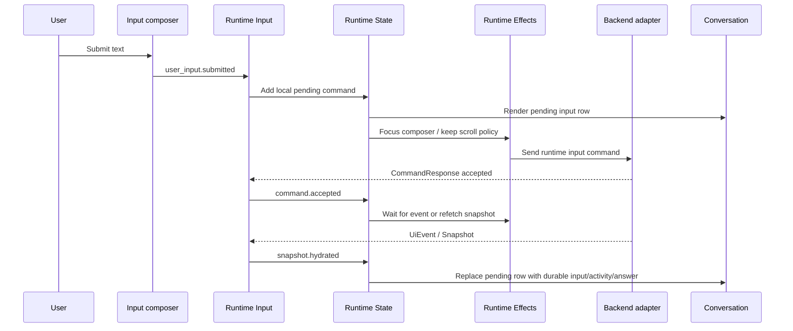
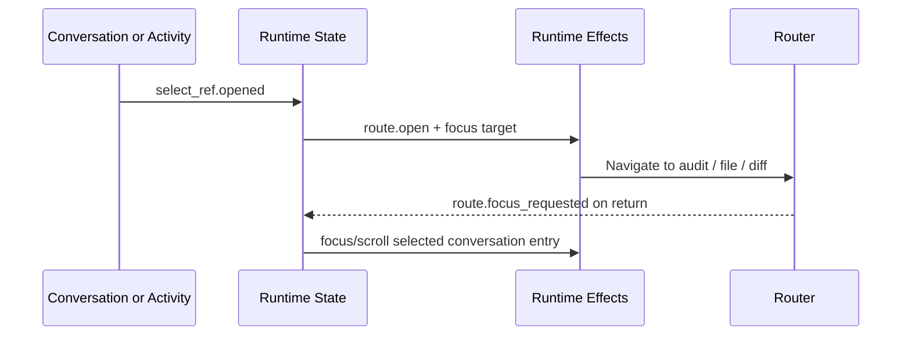

# Feature Plan: Frontend Interaction Runtime Architecture

> Status: draft
> Type: frontend architecture / interaction runtime
> Last Updated: 2026-06-27
> Scope: Main Page interaction runtime for conversation, plan, activity, audit links, and input composer
> Related Plans: [Main Page Frontend Runtime Integration](main-page-frontend-runtime-integration.md), [Session Conversation / Activity Timeline](session-conversation-activity-timeline.md), [Runtime Input Router Contract](runtime-input-router-contract.md), [Read-Only Inquiry Context](read-only-inquiry-context.md)
> Architecture: [Frontend Architecture Plan](../../frontend/frontend-architecture-plan.md), [UI And Backend Communication](../../architecture/ui-backend-communication.md), [Task Domain/UI Model Separation](../../architecture/task-domain-ui-model-separation.md)

---

## 1. Purpose

The Main Page frontend has moved beyond a fixture-first prototype. It now renders
durable session facts, runtime input routing, session activity, ASK/confirmation
cards, archived plan affordances, file/diff links, and read-only inquiry answers.
The next frontend risk is not a missing API endpoint; it is scattered interaction
ownership.

This plan defines the interaction runtime as four explicit layers:

1. Runtime Input Layer: user input, command, event, snapshot.
2. Runtime State Layer: query cache, local pending, interaction reducer,
   selection/detail state.
3. Runtime Effects Layer: refetch, scroll, focus, route, overlay.
4. Runtime View Layer: conversation, plan, activity, audit, input composer.

The design goal is to stop treating "fetch snapshot again" as the only frontend
coordination tool. Snapshots remain the durable source of truth, but user
interaction must have a local runtime model so the UI can feel responsive,
preserve focus/scroll, render optimistic pending states safely, and expose
activity/audit navigation without accidental layout resets.

---

## 2. Current Code Facts

| Area | Current fact | Gap |
|---|---|---|
| Runtime adapter | `frontend/src/pages/main-page/runtime/adapter.ts` defines the stable Main Page adapter boundary for snapshots, commands, events, activity, diagnostics, token usage, and workspace catalog calls. | The adapter boundary is broad, but the interaction lifecycle above it is still distributed across the controller and Workbench. |
| Command handling | `runtime/commandRefresh.ts` maps `CommandResponse` into refetch/error/recovery behavior. Runtime input command lifecycle is represented by `runtime/mainPagePendingRuntime.ts`. | Non-runtime-input command families still rely on command-specific mutation state instead of a shared command ledger. |
| Event handling | `runtime/eventRouter.ts` treats UI events as conservative refetch hints and sanitizes command failure messages. | Events do not yet produce typed runtime actions or local patch candidates. |
| Local pending runtime | `runtime/mainPagePendingRuntime.ts`, `useMainPageInputRuntimeState.ts`, `useMainPageRuntimeInputMutation.ts`, and `mainPageRuntimeInput.ts` now provide the local pending submit reducer, command id threading, pending activity projection, failed/rejected states, and snapshot reconciliation for Runtime Input Router submissions. | This covers Slice B/C for runtime input; focus/scroll and overlay are intentionally handled by separate runtime slices. |
| Focus/scroll runtime | `runtime/mainPageFocusScrollRuntime.ts` defines explicit focus/scroll effect requests and tested policy helpers; `useMainPageFocusScrollRuntime.ts` applies them to the conversation list, input composer, selected task card, selected activity item, ASK card, and overlay close-return trigger. | DOM effect hooks now cover composer focus, conversation-bottom scroll, route-return task focus, ASK-card focus, selected Activity focus, and overlay close-return focus; audit/file/diff return focus remains open. |
| Overlay runtime | `runtime/mainPageOverlayRuntime.ts` and `useMainPageOverlayRuntime.ts` own Activity, archived Plan list/detail, selected archived task, activity loading, and diagnostics export status state. | The runtime state is in place; remaining work is to normalize route-return targets for audit/file/diff links opened from overlay actions. |
| Main controller | `useMainPageController.ts` has been split into command, snapshot, selection, session, event, and input-runtime hooks. | It is now a composition root; future interaction behavior should go into focused runtime hooks instead of returning to a large controller file. |
| Workbench | `MainPageWorkbench.tsx` owns conversation composition, plan expansion, detail width, archived-plan presentation, and input composer wiring while delegating focus/scroll and overlay transitions to runtime hooks. | View composition is still large and should be split only after runtime ownership remains stable. |
| View model | `mainPageViewModel.ts` and selectors shape backend facts into renderable UI state. | The view model is useful, but it does not cover local pending interaction intent or effect requests. |

These facts make a layered runtime valuable even before larger visual redesign
work. The architecture below can be implemented incrementally while preserving
the existing adapter, query cache, and view-model contracts.

---

## 3. Source-Of-Truth Rules

| Rule | Meaning |
|---|---|
| Snapshot is durable truth | `MainPageSnapshot` and workspace/session catalog queries own durable plan, task, message, activity, ASK, confirmation, result, and file-change facts. |
| Command response is lifecycle truth | `CommandResponse` says accepted/rejected, recovery action, and refresh intent; it should not invent durable messages or plan state. |
| Event is coordination truth | `UiEvent` currently invalidates/refetches; future typed events may also emit bounded local patch actions, but they must reconcile against the next snapshot. |
| Local pending is transient truth | Local pending state exists to keep the interface responsive until snapshot/activity facts confirm or reject the operation. |
| DOM effects are not state | Scroll, focus, route, and overlay changes are effect outputs derived from runtime actions/state, not hidden state inside view components. |

---

## 4. Layered Architecture

```mermaid
flowchart LR
  subgraph Input["Runtime Input Layer"]
    UI["User input"]
    CMD["Command response"]
    EVT["UiEvent"]
    SNAP["Snapshot"]
  end

  subgraph State["Runtime State Layer"]
    QC["Query cache"]
    PEND["Local pending"]
    RED["Interaction reducer"]
    SEL["Selection / detail state"]
  end

  subgraph Effects["Runtime Effects Layer"]
    REF["Refetch"]
    SCR["Scroll"]
    FOC["Focus"]
    RTE["Route"]
    OVR["Overlay"]
  end

  subgraph View["Runtime View Layer"]
    CONV["Conversation"]
    PLAN["Plan"]
    ACT["Activity"]
    AUD["Audit"]
    INPUT["Input composer"]
  end

  Input --> State
  State --> Effects
  State --> View
  Effects --> Input
```



### 4.1 Runtime Input Layer

The input layer normalizes every outside signal into a typed runtime action.

| Input | Examples | Current owner | Target responsibility |
|---|---|---|---|
| User input | Session message submit, task guidance, ASK answer, confirmation response, stop/retry/archive plan. | `ContextInputPanel`, detail panels, `useMainPageController.actions`. | Emit `user_input.*` actions with scope, target, draft text, idempotency key, and intended post-submit focus behavior. |
| Command | Accepted/rejected command responses, recovery actions, refresh hints. | `useMainPageController` mutations and `runtime/commandRefresh.ts`. | Emit `command.accepted`, `command.rejected`, `command.failed`, and `command.reconciled` actions keyed by command id. |
| Event | `UiEvent`, command failure, resync required, activity/message updates. | `runtime/eventRouter.ts` and controller event subscription. | Emit `event.received` actions, then choose refetch, local patch, or no-op through one policy point. |
| Snapshot | Main Page snapshot, workspace catalog, session activity timeline, token usage. | TanStack Query usage in controller and Workbench activity loader. | Emit `snapshot.hydrated` and `snapshot.reconciled` actions with identity/cursor metadata. |

Target action examples:

```ts
type RuntimeAction =
  | { type: "user_input.submitted"; commandId: string; scope: "session" | "task"; text: string }
  | { type: "command.accepted"; commandId: string; refresh: "event" | "snapshot" | "none" }
  | { type: "command.rejected"; commandId: string; message: string; recoveryActions: string[] }
  | { type: "event.received"; cursor: string | null; eventType: string }
  | { type: "snapshot.hydrated"; snapshotId: string; cursor: string | null }
  | { type: "route.focus_requested"; target: RuntimeFocusTarget }
  | { type: "overlay.opened"; overlay: "activity" | "archivedPlan" | "diagnostics" };
```

### 4.2 Runtime State Layer

The state layer separates durable cache state from transient local interaction
state.

| State bucket | Owns | Current state | Target state |
|---|---|---|---|
| Query cache | Durable backend facts and stale/fresh lifecycle. | Main snapshot and catalog queries are controller-owned; activity overlay may load separately. | Query cache remains durable truth, but runtime state records which snapshot reconciled which local command/event. |
| Local pending | Pending user-visible affordances while backend work is accepted but not yet reflected. | Mutation flags, `activeRuntimeInputMode`, `runtimeActivityItems`, input error/recovery state. | Command-ledger-backed pending state with submitted text, target, timestamp, status, and reconciliation evidence. |
| Interaction reducer | Pure transitions for local UI intent. | Mostly implicit in `useState` calls across controller and Workbench. | A pure reducer owns selection intent, focus intent, scroll intent, overlay intent, and local pending transitions. |
| Selection/detail state | Selected task, plan, file changes, result, detail override. | Controller owns selected task/detail override; Workbench owns plan expansion and overlay selection. | Selection/detail state is a single runtime slice so route/deep-link/activity clicks can choose detail consistently. |

The reducer should be pure and testable. Query fetches, DOM focus, scroll calls,
and navigation must be emitted as effect requests instead of executed inside the
reducer.

### 4.3 Runtime Effects Layer

The effects layer performs side effects requested by runtime state.

| Effect | Trigger | Current behavior | Target behavior |
|---|---|---|---|
| Refetch | Command refresh hint, event router action, manual recovery, route/session switch. | Conservative refetch from controller/event paths. | Coalesced refetch scheduler keyed by workspace/session/query identity, with loop guards and reason metadata. |
| Scroll | New conversation item, user sends input, route focuses audit/activity, archived plan opens. | Mostly browser/default behavior and component-local scrolling. | Scroll effect policy with "auto-scroll only when user is near bottom" and explicit focus target support. |
| Focus | Submit completes/rejects, ASK card appears, overlay closes, task selection changes. | Not consistently modeled. | Focus effect requests with target priority: composer, first ASK field, selected task, activity/audit link. |
| Route | Session/task/audit/deep links, file/diff inspection return links. | URL building exists in multiple view areas. | Route effect normalizes route writes and route-derived runtime input. |
| Overlay | Activity drawer, archived plan list/detail, selected archived task, diagnostics/export status. | `mainPageOverlayRuntime.ts` owns overlay visibility, activity loading, archived-plan selection, selected archived task, and diagnostic export status. | Route-return metadata for audit/file/diff links opened from overlays should join the same runtime effect path. |

Effects must be idempotent. A refetch effect should be safe to replay; a focus
or scroll effect should include a target id and generation counter so React
rerenders do not repeat old DOM effects.

### 4.4 Runtime View Layer

The view layer renders runtime view models and emits user intent. It should not
decide transport behavior.

| View | Owns | Emits |
|---|---|---|
| Conversation | Durable messages, router interpretation, read-only answers, ASK cards, local pending input/answer rows. | Select activity item, answer question card, open ref, scroll intent. |
| Plan | Active or archived Plan & Progress, task cards, task detail selection, publish/archive actions. | Select plan/task, publish plan, archive plan, open archived plan. |
| Activity | Full session activity list, activity refs, diagnostic/export affordances. | Open audit/file/diff/diagnostic refs, refresh activity, close overlay. |
| Audit | Audit link entry points from session, task, activity, archived plan. | Route intent only; audit page owns its own data load. |
| Input composer | Draft text, target scope, pending/error/disabled states, submit affordance. | `user_input.submitted`, draft changed, target changed, recovery action selected. |

Views should accept renderable props plus event callbacks. They should not call
adapter commands directly, manually invalidate queries, or mutate route/search
params without going through runtime actions/effects.

---

## 5. Runtime Flow Targets

### 5.1 User Submits A Session Question



### 5.2 Activity Or Audit Link Opens



---

## 6. Migration Slices

| Slice | Scope | Acceptance |
|---|---|---|
| A. Architecture baseline | Add this layered architecture and map current code ownership. | Feature plan exists and is linked from the feature plan index. |
| B. Runtime input pending reducer | Mainline implementation: `runtime/mainPagePendingRuntime.ts` defines the local pending command ledger and reducer for Runtime Input Router submissions. | Unit tests cover submit started, command accepted/rejected/failed/reconciled, reset, durable message/activity reconciliation, and projection to activity items. |
| C. Local pending submit integration | Mainline implementation: `useMainPageInputRuntimeState.ts`, `useMainPageRuntimeInputMutation.ts`, and `mainPageRuntimeInput.ts` wire command id threading, pending activity projection, and mutation lifecycle integration. | User sees immediate submitted text and an understanding row; failed/rejected states stay visible; durable snapshot/activity facts remove local pending rows. |
| D. Focus/scroll runtime | Initial implementation: `runtime/mainPageFocusScrollRuntime.ts` and `useMainPageFocusScrollRuntime.ts` add explicit focus/scroll effect requests, near-bottom policy, conversation bottom anchoring, input composer focus after submit, route-return selected-task focus, and ASK-card focus. | Unit tests cover scroll/focus policy; Workbench tests cover composer focus after submit, route-return selected-task focus, and execution ASK focus; Electron/dev smoke verifies submit responsiveness and scroll stability with real app geometry. |
| E. Route/overlay runtime | Initial implementation: `mainPageOverlayRuntime.ts` and `useMainPageOverlayRuntime.ts` move Activity, archived Plan, selected archived task, and diagnostics/export overlay state into runtime state; focus/scroll runtime handles selected Activity focus and overlay close-return focus. | Unit tests cover overlay reducer transitions; Workbench tests cover archived Plan close-return focus and selected Activity focus; Electron smoke covers Activity selected-row focus and close-return focus. Audit/file/diff return focus is still a follow-up. |
| F. View extraction | Slim `MainPageWorkbench` into runtime-connected panels with no adapter calls. | Workbench becomes composition only; runtime hooks own input/state/effects; existing tests still pass. |

### 6.1 Mainline Pending Runtime Alignment

The mainline pending runtime should remain the single source for local Runtime
Input Router pending state. Do not introduce a second generic interaction
runtime reducer for submitted input.

Current accepted boundaries:

- `runtime/mainPagePendingRuntime.ts`
  - owns the local pending command ledger for Runtime Input Router submissions;
  - projects local user input and "Plato is understanding" rows into
    `SessionActivityItemView`;
  - preserves failed/rejected state until reset;
  - reconciles against durable snapshot messages and activity items.
- `useMainPageInputRuntimeState.ts`
  - owns input draft state, active runtime input mode, confirmed runtime
    activities, pending runtime state, and pending activity projection.
- `mainPageRuntimeInput.ts`
  - owns Runtime Input Router request construction, command id generation,
    mode selection, and synthetic user activity projection for confirmed
    route results.
- `useMainPageRuntimeInputMutation.ts`
  - wires `onMutate` submit-started state before network resolution;
  - uses the same command id in the request and pending runtime;
  - marks accepted, rejected, failed, and reconciled states.

What remains after this alignment:

- There is no generic `RuntimeEffectRequest` queue in production code yet.
- Focus/scroll has started as a separate runtime slice next to
  `mainPagePendingRuntime.ts`; it should continue there instead of expanding
  pending submit state.
- Selection/detail state is already separated through
  `useMainPageSelectionState.ts`; route-derived selected-task focus now enters
  through `MainPageRoute` and the focus/scroll runtime.
- Selected activity focus and overlay close-return focus now enter through the
  focus/scroll runtime.
- Activity, archived Plan, selected archived task, and diagnostics/export
  overlay state now enter through the overlay runtime.

---

## 7. Open Gaps

### P0

- Keep Electron/dev focus/scroll runtime acceptance running as a release gate,
  not only browser unit tests.
- Preserve local pending submit behavior while expanding scroll/focus effects.
- Preserve selected activity focus and overlay close-return focus while route
  and overlay behavior continue to be split out of Workbench composition.

### P1

- Coalesce refetch requests across command/event/snapshot paths with reason
  metadata and loop guards.
- Standardize route-derived runtime inputs for session/task/audit/file/diff
  return focus.

### P2

- Split large Main Page view composition after runtime ownership is stable.
- Add runtime diagnostics for "why did the UI refetch/scroll/focus/open this
  overlay?"
- Consider conversation virtualization only after focus/scroll behavior is
  contractually stable.

---

## 8. Non-Goals

- Do not redesign the Main Page visual system in this plan.
- Do not replace TanStack Query as the durable data cache.
- Do not introduce backend API shapes from frontend code.
- Do not implement token streaming or partial LLM streaming here.
- Do not move Audit Page data loading into Main Page runtime.

---

## 9. Acceptance Criteria For Future Implementation

1. Every user-facing interaction enters through a named runtime action.
2. Durable facts still come from query snapshots or activity/audit APIs.
3. Local pending state is visible, reversible, and reconciled.
4. Refetch, scroll, focus, route, and overlay are emitted as explicit effect
   requests.
5. Conversation, Plan, Activity, Audit, and Input Composer views render props
   and emit intent; they do not own adapter command policy.
6. Pure reducer tests cover state transitions.
7. Electron acceptance covers submit responsiveness, focus return, scroll
   stability, archived plan opening, and audit return links.

---

## 10. Risks And Assumptions

- Assumption: Backend snapshots remain the only durable source for plan/task and
  conversation facts.
- Assumption: Runtime Input Router may answer, ask, or hand off to execution,
  but the frontend should model all three as the same input lifecycle.
- Risk: Adding local pending state without command ids will create duplicate
  conversation rows after refetch. The command ledger must be id/key based.
- Risk: Moving overlay state before route/focus semantics are defined can make
  archived plan and audit navigation harder to reason about.
- Risk: More component extraction before reducer/effect ownership is settled can
  move complexity around without reducing it.
